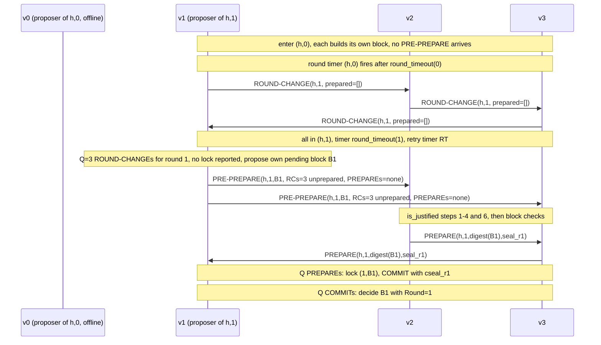

# A-14 프로토콜: 메시지 교환으로 본 합의

- 영역 코드: `PROTO`
- 상태: 초안
- 레퍼런스 구현: go-stablenet `740526d03`. 모든 `Source:` 경로는 저장소 루트를 기준으로 한다.

이 장은 WBFT 를 노드 사이의 프로토콜로 설명한다. 누가 어떤 메시지를 누구에게 어떤 순서와 내용으로 보내는지, 받는 쪽이 무엇을 검사하는지를 세 경우로 나누어 적는다. 첫째는 한 높이가 정상적으로 끝나는 경우이고, 둘째는 round 를 바꿔야 하는 경우이며, 셋째는 round change 뒤에 합의가 이어지는 경우다. 이 장은 `A-00` 바로 다음에 읽는다.

---

## 1. 목적과 읽는 법

`A-05` 는 WBFT 를 반응 규칙의 집합으로 정한다. 즉 event 마다 (메시지, timer, 새 head) 노드 하나가 무엇을 하는지를 적는다. 그 관점은 완전하고 규범이지만, 교환 전체의 모양은 보여 주지 않는다. 이 장은 다른 관점을 제공한다. 반응 규칙들이 validator 들 사이에서 만들어 내는 메시지의 순서를 보여 주고, 그 순서가 왜 그런 모양인지를 설명한다.

이 장의 서술은 대부분 다른 장의 requirement 에서 나온 결과이며, 그 requirement 를 ID 로 인용한다 (`A-05` 의 `WBFT-SM-…`, `A-06` 의 `WBFT-TIMER-…`, `A-07` 의 `WBFT-NET-…`, `A-03` 의 `WBFT-MSG-…`, `A-04` 의 `WBFT-VAL-…`/`WBFT-PROP-…`, `A-08` 의 `WBFT-HDR-…`). 프로토콜 관점에서 검사할 수 있는 성질이 나오는데 다른 장이 그 성질을 적지 않은 경우에만, 이 장은 그것을 `WBFT-PROTO-NNN` requirement 로 적는다. 이 장과 인용한 장이 서로 다르면 인용한 장이 맞고, 이 장에 편집 오류가 있는 것이다.

표기: `h` 는 합의하는 높이 (sequence), `r` 은 round, `N` 은 `h` 의 validator 수, `Q = quorum_size(N)`, `F = f_value(N)` 이다 (`A-04` §2). `B` 는 block 이름이다. "lock" 은 `A-05` §3.1 의 쌍 `(current.prepared_round, current.prepared_block)` 을 뜻하고, "certificate" 는 `prepared_certificate`, 즉 그 lock 을 만든 `Q` 개의 PREPARE 를 뜻한다.

---

## 2. 참여자와 역할

| 참여자 | 보내는 것 | 받는 것 | 참고 |
|---|---|---|---|
| `h` 의 validator | 받아들인 PRE-PREPARE 마다 PREPARE 와 COMMIT 을 보낸다. round change 때 ROUND-CHANGE 를 보낸다. 성공적으로 처리한 메시지는 모두 relay 한다 | 다른 validator 들이 보낸 네 가지 메시지를 직접 또는 relay 로 받는다 | 모든 validator 는 `h` 의 후보 block 도 만든다 (`A-06` WBFT-TIMER-040). 그래서 proposer 가 되었을 때 제안할 block 을 이미 가지고 있다 |
| `(h, r)` 의 proposer | 위에 더해 `(h, r)` 의 PRE-PREPARE 를 보낸다 | 위와 같다 | `calc_proposer(validators_at(h), last_proposer(h), r, policy)` 이다 (`A-04` WBFT-PROP-001). `h` 의 모든 round 에 같은 `last_proposer` 를 쓰므로 proposer 는 `r` 에 따라 돌아간다 |
| 합의 코어를 돌리지만 `validators_at(h)` 에 없는 노드 | 자기 메시지는 보내지 않는다 (`A-05` WBFT-SM-003). 처리한 메시지는 relay 한다 (`A-07` WBFT-NET-040) | conformance 를 따르는 peer 로부터는 아무것도 받지 않는다 (`A-07` WBFT-NET-031) | 메시지를 받는다면 검증하고 relay 하고 decide 까지 한다 |
| validator 가 아닌 노드 (full node, observer) | `istanbul/100` 으로 아무것도 보내지 않는다 | `istanbul/100` 으로 아무것도 받지 않는다 | 확정된 block 을 header 의 seal 과 함께 eth block 전파와 동기화로 받는다 (`B-09`) |

두 가지 문턱값이 프로토콜을 움직인다. `Q = floor(2N/3) + 1` (`A-04` WBFT-VAL-002) 은 모든 quorum 의 크기다. PREPARE, COMMIT, ROUND-CHANGE, justification 의 quorum 과 header 의 최소 sealer 수가 모두 `Q` 이다. 이른 round change 규칙은 더 높은 round 의 ROUND-CHANGE 를 보낸 서로 다른 validator 수가 정확히 `floor((N-1)/3) + 1` 에 이를 때 발동하며, 이 값을 "F+1" 로 쓴다 (`A-04` WBFT-VAL-003). `N = 0 … 22` 의 값은 `A-04` §2.2 의 표에 있다. 이 장의 예에서는 `N = 4` 이므로 `Q = 3`, `F = 1`, F+1 = 2 이다.

---

## 3. 메시지 한눈에 보기

### 3.1 네 가지 메시지

모든 메시지는 `sequence` 와 `round` 를 가지며, 보내는 노드의 node key 로 `rlp([code, signed_fields])` 에 ECDSA 서명을 한다 (`A-02` WBFT-CRYPTO-011, `A-03` WBFT-MSG-002). 보낸 사람은 필드가 아니다. 받는 쪽이 signature 에서 보낸 사람을 복구한다. 바이트 배치는 `A-03` §8 에 있다.

| 메시지 | 코드 | 서명하는 필드 (ECDSA payload) | 담는 BLS seal | 서명 밖에 붙는 것 | 누가 언제 보내는가 | 크기 |
|---|---|---|---|---|---|---|
| PRE-PREPARE | `0x12` | `[sequence, round, proposal]` 이며 proposal 은 block 전체다 | 없다 | `justification_round_changes` (서명된 ROUND-CHANGE payload 들) 와 `justification_prepares` (PREPARE 들) 이다. round 0 에서는 둘 다 비어 있다 (`A-03` WBFT-MSG-040) | `(h, r)` 의 proposer 가 보낸다. round 0 에서는 자기 block 이 만들어졌을 때 보내고 (`A-05` WBFT-SM-032), round `r > 0` 에서는 `r` 의 ROUND-CHANGE 를 `Q` 개 가졌을 때 보낸다 (WBFT-SM-058) | block 전체의 크기에, round `r > 0` 이면 ROUND-CHANGE payload 하나당 약 75–110 바이트와 PREPARE 하나당 약 204 바이트가 더해진다 |
| PREPARE | `0x13` | `[sequence, round, digest, prepare_seal]` | `prepare_seal = bls_sign(seal_data(header(B), r, PREPARE_SEAL))` 이다 (`A-02` WBFT-CRYPTO-040, -042) | 없다 | `(h, r)` 의 PRE-PREPARE 를 받아들인 모든 validator 가 보낸다 (WBFT-SM-039, -040) | 약 204 바이트다 (digest 32 바이트, seal 96 바이트, signature 65 바이트) |
| COMMIT | `0x14` | `[sequence, round, digest, commit_seal]` | `commit_seal = bls_sign(seal_data(header(B), r, COMMIT_SEAL))` 이다 | 없다 | `(h, r)` 의 PREPARE 를 `Q` 개 모은 모든 validator 가 보낸다 (WBFT-SM-043, -044) | 약 204 바이트다 |
| ROUND-CHANGE | `0x15` | `[sequence, round, prepared]` 이며 `prepared` 는 `[]` 또는 `[prepared_round, prepared_digest]` 이다 (`A-03` WBFT-MSG-030) | 없다 | `prepared_block` (block 전체) 과 `justification` (certificate 의 PREPARE `Q` 개) 이다 (`A-03` WBFT-MSG-031) | 모든 validator 가 round timeout, F+1 규칙, `finalize` 실패, 그리고 retry timeout 때마다 보낸다 (WBFT-SM-051) | lock 이 없으면 약 77 바이트다. lock 이 있으면 block 전체에 약 `Q × 204` 바이트가 더해진다 |

`digest` 는 언제나 `block_hash(B)` 이며, 현재 block 의 seal 과 round 를 빼고 계산한다 (`A-03` WBFT-ENC-082, -083). `seal_data` 에는 round 가 들어간다 (`A-02` WBFT-CRYPTO-040). 그래서 seal 은 그 seal 을 만든 round 에서만 유효하다. 표의 크기는 작은 `sequence` 와 `round` 값을 가정하고 `A-03` 의 인코딩에서 계산한 값이다. 네트워크에서 재지는 않았다.

PRE-PREPARE 의 ECDSA 서명은 justification 을 덮지 않고, ROUND-CHANGE 의 서명은 `prepared_block` 과 `justification` 을 덮지 않는다. justification 의 각 원소는 자기 서명을 가지며, 받는 쪽이 그 서명을 검사한다 (`A-05` WBFT-SM-017). ROUND-CHANGE 의 prepared block 은 decoder 와 handler 가 서명된 `prepared_digest` 와 맞는지 확인한다 (`A-03` WBFT-MSG-032, `A-05` WBFT-SM-054).

### 3.2 wire framing 과 전달

네 가지 메시지는 devp2p subprotocol `istanbul/100` 으로 오가며, 같은 연결의 `eth/68` 옆에서 동작한다 (`A-07` §2). `eth/68` 이 협상되어 있으면 wire 코드는 `0x33` 부터 `0x36` 까지다. frame payload 는 `rlp_encode(message)` 를 바꾸지 않고 그대로 쓰며, devp2p 가 snappy 로 압축한다 (`A-07` WBFT-NET-010). payload 가 10 MiB 보다 길면 받는 쪽이 연결을 끊는다 (WBFT-NET-013).

노드는 자기가 만든 메시지를, 주소가 현재 validator 집합에 있는 연결된 peer 모두에게 보낸다. 자기 자신에게는 보내지 않고, 대신 일반 수신 경로로 자기에게 전달한다 (`A-07` WBFT-NET-030, -031; `A-05` WBFT-SM-014). 받은 메시지를 오류 없이 처리한 노드는 같은 바이트를, 그 메시지의 키를 아직 갖지 않은 validator 들에게 relay 한다 (WBFT-NET-040, -032). 다만 backlog 에 두었다가 나중에 처리한 메시지는 다시 인코딩한 바이트로 relay 한다. `A-03` WBFT-ENC-090 의 ROUND-CHANGE 경우에는 그래서 바이트와 키가 달라진다 (WBFT-NET-041). 중복은 키 `keccak256(rlp_encode(payload))` 로 peer 별로, 그리고 전체로 걸러진다. 이 키는 payload 를 RLP 바이트 문자열로 한 번 더 인코딩한 값의 hash 이다 (WBFT-NET-022 부터 -024). 보내기와 전달은 비동기이므로, 한 송신자가 보낸 메시지들 사이에서도 순서를 가정할 수 없다 (WBFT-NET-025, -033; `A-05` WBFT-SM-002).

---

## 4. 정상 경우: round 0 에서 확정되는 한 높이

### 4.1 절차

아래 단계는 모든 validator 가 올바르고 모든 메시지가 round timeout 안에 도착할 때 일어나는 일이다. "각 validator" 에는 proposer 도 들어간다.

1. **새 head.** block `h − 1` 이 체인 head 가 된다. 각 validator 는 새 head 를 처리하고 상태 `AcceptRequest` 로 view `(h, 0)` 에 들어간다. 이때 `validators_at(h)` 를 읽고, `(h, 0)` 의 proposer 를 계산하고, round change 집합과 prepared certificate 를 비우고, round timer 를 `round_timeout(0) = RT(h)` 로 건다 (`A-05` WBFT-SM-022 부터 -030; `A-06` WBFT-TIMER-010). 노드는 `(h, 0)` 에 해당하는 메시지를 backlog 에 넣어 두었다면 그 메시지도 다시 처리한다.
2. **block period 대기와 block 조립.** 각 validator 의 block builder 는 `Time(h − 1) + BP(h)` 까지 기다린 뒤 `h` 의 후보 block 을 만든다 (`A-06` WBFT-TIMER-040, -042). 완성된 block 은 요청으로 합의 코어에 넘어가고 `pending_request` 로 저장된다 (WBFT-SM-032).
3. **PRE-PREPARE.** proposer 에서는 그 요청 때문에 코어가 justification 목록이 빈 `PRE-PREPARE(h, 0, B)` 를 보낸다 (WBFT-SM-032, -035). proposer 가 아닌 노드는 자기 block 을 저장하기만 한다.
4. **수락 검사.** 각 validator 는 (proposer 는 self-delivery 로) 다음을 이 순서로 검사한다. 보낸 사람이 `(h, 0)` 의 proposer 인지, `sequence == B.number` 인지, `B` 가 proposal 검증을 통과하는지 (`A-08` §5, `A-09`) 를 본다. round 0 에는 justification 검사가 없다 (WBFT-SM-037). block 의 timestamp 가 받는 노드의 시계보다 앞서 있으면, 노드는 그 시각까지 PRE-PREPARE 를 보류했다가 다시 검사한다 (WBFT-SM-038, `A-06` WBFT-TIMER-030). 거부된 PRE-PREPARE 에는 답하지 않고 relay 도 하지 않는다.
5. **PREPARE.** 수락하면 validator 는 이 순간부터 전체 `round_timeout(0)` 으로 round timer 를 다시 걸고, PRE-PREPARE 를 기록하고, `Preprepared` 로 들어가고, `PREPARE(h, 0, block_hash(B), prepare_seal)` 을 broadcast 한다 (WBFT-SM-039, -040; `A-06` WBFT-TIMER-012). 그리고 PRE-PREPARE 를 relay 한다.
6. **Prepared (lock).** 각 validator 는 `(h, 0)` 의 PREPARE 마다 digest 가 `block_hash(B)` 와 같은지, prepare seal 이 보낸 사람의 BLS 키로 round 0 에 대해 검증되는지를 확인한다 (WBFT-SM-041). 서로 다른 보낸 사람 `Q` 명의 PREPARE 가 저장되면, 노드는 lock 을 `(0, B)` 로 정하고, 그 `Q` 개의 PREPARE 사본을 certificate 로 남기고, `Prepared` 로 들어가고, `COMMIT(h, 0, block_hash(B), commit_seal)` 을 broadcast 한다 (WBFT-SM-043, -044).
7. **decision.** 각 validator 는 COMMIT 도 같은 방법으로 검사한다 (WBFT-SM-045). 서로 다른 보낸 사람 `Q` 명의 COMMIT 이 저장되면 노드는 `Committed` 로 들어간다. 그리고 가진 prepare seal `Q` 개와 commit seal `Q` 개를 `B` 의 header 의 `PreparedSeal` 과 `CommittedSeal` 로 aggregate 하고, `Round = 0` 으로 적은 뒤, seal 된 block 을 import 하라고 application 에 넘긴다 (WBFT-SM-046 부터 -048; `A-08` WBFT-HDR-050). block hash 는 바뀌지 않는다 (WBFT-HDR-051). round timer 는 멈추지 않는다 (WBFT-SM-050).
8. **extra seal.** 각 quorum 이 찬 뒤에 도착한 `(h, 0)` 의 PREPARE 와 COMMIT 은 검증한 뒤 extra seal 로 보관하고 relay 한다 (`A-05` §12, `A-07` WBFT-NET-042). `h + 1` 의 proposer 는 자기가 가진 `h` 의 extra seal 을 block `h + 1` 의 `PrevPreparedSeal` / `PrevCommittedSeal` 에 합친다 (`A-08` §3.8). 그래서 늦게 seal 한 validator 도 체인에 기록된다.
9. **다음 높이.** block `h` 의 import 가 끝나면 block `h` 가 head 가 되고, `h + 1` 에 대해 1 단계가 시작된다. 스스로 decide 하지 못한 노드 (늦은 validator, validator 가 아닌 노드) 는 block `h` 를 seal 과 함께 eth block 전파로 받고, header 의 seal 을 검증한다 (`A-08` §6).

header 의 seal 은 노드마다 다르므로, 두 validator 가 hash 는 같고 sealer 집합이 다른 block `h` 의 사본을 저장할 수 있다 (`A-08` WBFT-HDR-053, `A-05` WBFT-SM-048).

### 4.2 sequence diagram (N = 4)

`v0` 는 `(h, 0)` 의 proposer 다. relay 는 그리지 않았다. validator 로 가는 화살표는 다른 노드의 relay 로도 그 validator 에 도달한다. self-delivery 는 보낸 노드 자신으로 가는 화살표로 그렸다.

```mermaid
sequenceDiagram
    participant v0 as v0 (proposer of h,0)
    participant v1
    participant v2
    participant v3
    Note over v0,v3: head = h-1, all enter (h,0), arm round timer RT(h)
    Note over v0,v3: wait until Time(h-1)+BP(h), each builds a candidate block
    v0->>v0: request(B), send PRE-PREPARE
    v0->>v1: PRE-PREPARE(h,0,B)
    v0->>v2: PRE-PREPARE(h,0,B)
    v0->>v3: PRE-PREPARE(h,0,B)
    Note over v0,v3: each checks proposer, number, block; re-arms timer; Preprepared
    v0->>v1: PREPARE(h,0,digest,seal_r0)
    v1->>v2: PREPARE(h,0,digest,seal_r0)
    v2->>v3: PREPARE(h,0,digest,seal_r0)
    v3->>v0: PREPARE(h,0,digest,seal_r0)
    Note over v0,v3: Q=3 PREPAREs: lock (0,B), certificate kept, Prepared
    v0->>v1: COMMIT(h,0,digest,cseal_r0)
    v1->>v2: COMMIT(h,0,digest,cseal_r0)
    v2->>v3: COMMIT(h,0,digest,cseal_r0)
    v3->>v0: COMMIT(h,0,digest,cseal_r0)
    Note over v0,v3: Q=3 COMMITs: Committed, seals aggregated into header, Round=0, finalize
    Note over v0,v3: block h imported, new head, enter (h+1,0)
```

그림을 읽기 쉽게 하려고 보낸 사람마다 PREPARE 와 COMMIT 화살표를 하나씩만 그렸다. 실제로 각 validator 는 자기 PREPARE 와 COMMIT 을 다른 모든 validator 에게 broadcast 한다.

### 4.3 시간표

mainnet preset (`BP = 1 s`, `RT = 2 000 ms`, 상한 없음) 에서 한 노드의 시각은 `A-06` §9.1 (전체 계산 예가 있는 곳) 을 따르면 다음과 같다.

| 시각 | 일어나는 일 | timer 상태 |
|---|---|---|
| `T_head` | 노드가 `(h, 0)` 에 들어간다 | round timer 의 마감은 `T_head + 2 s` 이다 |
| `Time(h − 1) + 1 s` | 모든 validator 가 block 을 만든다. proposer 의 header 는 `Time = Time(h − 1) + 1` 이다 | 바뀌지 않는다 |
| 여기에 조립과 실행 시간을 더한 때 | PRE-PREPARE 가 나간다 | 바뀌지 않는다 |
| 여기에 네트워크 지연 한 번을 더한 때 | PRE-PREPARE 가 수락되고 PREPARE 가 나간다 | round timer 를 다시 걸며, 마감은 `t_accept + 2 s` 이다 |
| 여기에 네트워크 지연 두 번을 더한 때 | PREPARE quorum 이 차서 COMMIT 이 나가고, COMMIT quorum 이 차서 decide 한다 | round timer 는 계속 돈다 |
| 여기에 import 시간을 더한 때 | 새 head 가 생기고 노드가 `(h + 1, 0)` 에 들어간다 | 새 round timer 를 걸고, 이전 timer 는 취소된다 |

`(h, 0)` 의 round timer 는 다음 head 로 view 가 바뀔 때만 취소된다. import 가 남은 timeout 보다 오래 걸리면, 노드는 decide 했는데도 round 를 바꾼다 (§5.6).

---

## 5. round change 로 이어지는 실패

### 5.1 round change 란 무엇인가

round change 를 일으키는 것은 실패 자체가 아니라 round timer 다. `(h, r)` 의 timer 는 round 에 들어갈 때 걸리고 PRE-PREPARE 를 수락할 때 다시 걸리며, 다음 view 변경 전에는 다른 어떤 것도 이 timer 를 멈추지 않는다 (`A-06` WBFT-TIMER-010, -012, -016). timer 가 만료되면 노드는 `AcceptRequest` 상태로 `(h, r + 1)` 에 들어가고 `ROUND-CHANGE(h, r + 1)` 을 broadcast 한다. 그 ROUND-CHANGE 의 prepared 쌍, prepared block, justification 은 노드의 lock 과 certificate 에서 온다 (`A-05` WBFT-SM-053). 그러므로 ROUND-CHANGE 의 내용은 무엇이 실패했는지가 아니라 노드가 round `r` 에서 어디까지 갔는지에 달려 있다 (§6). 새 round 의 timer 는 `round_timeout(r + 1)` 이며, 설정된 상한까지 round 마다 두 배가 된다 (`A-06` §4). ROUND-CHANGE 를 보낼 때마다 retry timer 도 걸린다 (§5.8).

아래 실패들은 timer 가 만료되기 전에 어느 노드가 어느 상태에 이르는지가 서로 다르다.

### 5.2 proposer 가 없거나 멈췄거나 PRE-PREPARE 가 사라진 경우

어떤 validator 도 PRE-PREPARE 를 수락하지 못한다. 그래서 각 validator 의 timer 는 그 validator 가 `(h, r)` 에 들어간 뒤 `round_timeout(r)` 이 지나면 만료된다. 각 validator 는 `AcceptRequest` 에 있으므로, `h` 의 앞선 round 에서 얻은 lock 이 없다면 prepared 쌍이 없는 `ROUND-CHANGE(h, r + 1)` 을 보낸다 (§6.2). `(h, r + 1)` 의 proposer 는 자기 block 을 제안한다 (§7). round 0 proposer 가 침묵하는 경우의 시간표는 `A-06` §9.2 에 있다.

### 5.3 PRE-PREPARE 가 거부된 경우

받는 노드는 proposer 가 서명하지 않은 PRE-PREPARE, `sequence` 가 block 번호와 다른 PRE-PREPARE, round `r > 0` 에서 justification 이 실패한 PRE-PREPARE, block 이 proposal 검증에 실패한 PRE-PREPARE 를 거부한다 (`A-05` WBFT-SM-037). 거부는 조용히 일어난다. 노드는 아무 메시지도 보내지 않고 그 PRE-PREPARE 를 relay 하지도 않는다 (`A-07` WBFT-NET-043). timestamp 가 받는 노드의 시계보다 앞선 block 은 거부하지 않고 그 차이만큼 보류한다. 보류가 남은 timeout 보다 길면 round 가 먼저 끝난다 (`A-06` WBFT-TIMER-030, -033). PRE-PREPARE 를 거부한 validator 는 §5.2 처럼 `AcceptRequest` 에서 timeout 된다. 수락한 validator 는 `Preprepared` 에 있으며 §5.4 처럼 timeout 된다.

### 5.4 PREPARE 가 사라져 PREPARE quorum 이 없는 경우

PRE-PREPARE 를 수락했지만 PREPARE 를 `Q` 개 모으지 못한 validator 는, 수락한 뒤 `round_timeout(r)` 이 지나 `Preprepared` 에서 timeout 된다. 이 validator 의 ROUND-CHANGE 에는 prepared 쌍이 없다. 즉 수락한 block 을 알리지 않는다 (§6.1). PREPARE 를 `Q` 개 모은 validator 는 lock 을 가지며 그 lock 을 알린다.

### 5.5 COMMIT 이 사라져 COMMIT quorum 이 없는 경우

`Prepared` 에 이르렀지만 COMMIT 을 `Q` 개 모으지 못한 validator 는 `Prepared` 에서 timeout 된다. 이 validator 의 ROUND-CHANGE 는 `(r, block_hash(B))`, block `B`, certificate 를 담는다. 다른 validator 가 COMMIT 을 `Q` 개 모아 `B` 를 decide 했을 수 있으므로, 더 높은 lock 이 없는 한 새 round 는 `B` 를 다시 제안해야 한다 (§6.3).

### 5.6 decide 했지만 timer 가 만료되기 전에 block 을 import 하지 못한 경우

`decide` 뒤에도 round timer 는 계속 돈다 (`A-05` WBFT-SM-050, `A-06` WBFT-TIMER-016). 그래서 두 경우가 생긴다 (`A-06` §5.4).

- **경우 A: head 가 아직 `h − 1` 이다.** 노드는 `(h, r + 1)` 에 들어가고, lock `(r, B)`, block, certificate 를 담은 `ROUND-CHANGE(h, r + 1)` 을 보낸다. 이 메시지는 `Prepared` 에 있는 노드가 보내는 것과 똑같다 (§6.1). F+1 개 validator 가 이렇게 하면 F+1 규칙이 나머지 노드도 `r + 1` 로 끌어온다. block `h` 의 import 가 끝나면 노드는 새 head 를 처리하고 `(h + 1, 0)` 에 들어간다. 확정된 block 은 사라지지 않는다. `(h, r + 1)` 에 들어간 다른 노드는 먼저 `h` 를 import 하거나, `B` 가 다시 제안되는 것을 보게 된다.
- **경우 B: head 는 `h` 로 앞섰지만 새 head event 를 아직 처리하지 않았다.** 노드는 catch-up 분기로 `(h + 1, 0)` 에 들어가고, prepared 쌍은 없지만 높이 `h` 의 certificate 를 justification 으로 단 `ROUND-CHANGE(h + 1, r + 1)` 을 보낸다. 이때 round change 집합과 certificate 는 초기화되지 않는다. 뒤이어 오는 새 head event 는 어떤 branch 도 고르지 않으므로, 두 값은 높이 `h + 1` 내내 남는다 (`A-05` WBFT-SM-028, WBFT-SM-080, `A-06` WBFT-TIMER-017). 노드의 retry timer 는 round 0 을 기억하므로, 노드는 그 뒤 `RT(h + 1)` 마다 `ROUND-CHANGE(h + 1, 0)` 을 다시 보낸다 (§5.8). catch-up 분기는 state 와 상관없다. timeout 을 처리할 때 head 가 이미 `h` 로 옮겨 가 있으면 (예를 들어 동기화로), 어떤 state 의 노드든 같은 분기를 탄다.

`finalize` 자체가 실패하면 (seal 을 header 에 적을 수 없으면), 노드는 round `r` 을 떠나지 않은 채 lock 을 담은 `ROUND-CHANGE(h, r + 1)` 을 곧바로 보낸다 (`A-05` WBFT-SM-049). 노드의 retry timer 는 round `r` 을 기억하므로, 노드는 round timer 가 만료될 때까지 `RT(h)` 마다 같은 lock 을 담은 `ROUND-CHANGE(h, r)` 을 다시 보낸다 (§5.8).

### 5.7 네트워크 분할과 서로 다른 round 에 있는 노드

timer 는 노드마다 따로 돌기 때문에 노드들이 서로 다른 round 에 있을 수 있다. PRE-PREPARE 를 늦게 수락했거나, 재시작했거나, 분할되어 있던 노드는 뒤처진다. 두 규칙이 round 를 다시 맞춘다.

1. **F+1 규칙.** round `r0` 에 있는 노드가 `r0` 보다 높은 round 의 ROUND-CHANGE 를 서로 다른 validator 정확히 F+1 명으로부터 가지면, 노드는 그런 round 중 가장 작은 round 에 들어가고 자기 timer 를 기다리지 않고 그 round 의 ROUND-CHANGE 를 곧바로 보낸다 (`A-05` WBFT-SM-057). 그 송신자 중 적어도 하나는 정직하므로, 적어도 한 정직한 노드가 이미 `r0` 보다 높은 round 에 있다는 뜻이다. 노드는 송신자들이 알린 round 중 가장 작은 round 로 가며, 그 round 가 그 정직한 노드의 round 라는 보장은 없다. 이 규칙은 수가 F+1 에 이를 때만 발동하고, 수가 F+1 을 건너뛰어 커지면 발동하지 않는다.
2. **backlog.** 다른 validator 가 보낸 메시지 중 현재 높이의 더 뒤 round (`r0 + 10` 까지) 의 메시지와, 다음 높이에서 round 가 10 보다 작은 메시지는 보관했다가 (송신자마다 최대 88개) 노드가 그 view 에 이르면 다시 처리한다 (`A-05` WBFT-SM-019, §13). 현재 높이의 더 높은 round 에 대한 ROUND-CHANGE 는 backlog 에 넣지 않고 곧바로 처리한다.

분할된 양쪽이 모두 `Q` 보다 적은 validator 를 가지면 어느 쪽에서도 decide 할 수 없다. 양쪽은 늘어나는 timeout 으로 계속 timeout 되고, 점점 높은 round 의 ROUND-CHANGE 를 보낸다. 분할이 풀리면 F+1 규칙이 낮은 쪽을 끌어올리고, 공통 round 에서 quorum 이 만들어질 수 있다. safety 에는 영향이 없다. decide 에는 COMMIT `Q` 개가 필요하고, 분할된 두 쪽이 모두 `Q` 를 가질 수는 없기 때문이다 (`A-05` §18.1).

### 5.8 재전송

노드가 ROUND-CHANGE 를 보낼 때마다 `RT(h)` 의 retry timer 가 걸린다 (두 배로 늘지 않는다). retry timer 가 만료되면 노드는 그 timer 를 걸 때 자기가 있던 round 에 대해 ROUND-CHANGE 를 다시 만들고 다시 서명한 뒤, timer 를 다시 건다 (`A-06` WBFT-TIMER-020, -021). 이것은 노드가 새 round 에 들어가거나 PRE-PREPARE 를 수락할 때까지 되풀이된다 (WBFT-TIMER-022, -023). round timeout 이나 F+1 규칙 뒤라면 기억한 round 는 원래 메시지의 round 이다. 서명이 결정적이고 인코딩이 정규형이므로, 이때 lock 과 certificate 가 바뀌지 않았다면 다시 보낸 메시지는 바이트 단위로 같다. gossip 은 그 키를 이미 가진 peer 를 모두 건너뛴다. 그래서 이런 재전송은 원래 송신 뒤에 연결된 peer 나 cache 항목이 밀려난 peer 에게만 wire 로 나간다 (`A-06` WBFT-TIMER-024). `finalize` 가 실패한 뒤에는 (§5.6) 기억한 round 가 `r` 이므로 재전송은 `(h, r + 1)` 이 아니라 `ROUND-CHANGE(h, r)` 이다. catch-up 분기 뒤에는 (§5.6 경우 B) 재전송이 `(h + 1, r + 1)` 이 아니라 `ROUND-CHANGE(h + 1, 0)` 이다. 이 두 재전송은 원래 메시지와 다르므로 wire 로 나간다. 노드가 새 head event 로 높이 `h + 1` 에 들어갈 때 이미 queue 에 있던 retry 만료도 그대로 처리된다. 그러면 노드는 lock 없이 `ROUND-CHANGE(h + 1, r_c)` 를 보낸다. 여기서 `r_c` 는 높이 `h` 의 round 이다 (`A-05` WBFT-SM-081, `A-06` WBFT-TIMER-021). 노드 안에서는 재전송이 proposer 의 quorum 검사를 다시 돌린다 (§7.1). 구현은 연결이 유지된 peer 사이에서 사라진 ROUND-CHANGE 를 재전송이 복구해 준다고 기대해서는 안 된다.

---

## 6. round change 가 시작된 단계별 차이

### 6.1 규칙

round change 가 "PRE-PREPARE 에서" (PREPARE quorum 전에) 시작될 때와 "PREPARE 에서" (PREPARE quorum 뒤에) 시작될 때 프로토콜이 다르며, 경계는 정확히 PREPARE quorum 이다.

[WBFT-PROTO-001] ROUND-CHANGE 의 prepared 쌍과 prepared block 은 반드시 보내는 순간의 송신자 lock 만으로 정해져야 하고, lock 은 반드시 PREPARE quorum 으로만 설정되어야 한다. 그 결과 `(h, r)` 의 round timer 가 만료된 노드는 다음과 같이 보낸다. (1) round `r` 의 `AcceptRequest` 나 `Preprepared` 에 있고 `h` 의 앞선 round 에서 얻은 lock 이 없으면, ROUND-CHANGE `(h, r + 1)` 은 `prepared = []`, 0 인 `prepared_digest`, 비어 있는 `prepared_block`, 빈 `justification` 을 가진다. round `r` 에서 PRE-PREPARE 를 수락했더라도 그렇다. (2) round `r` 의 `Prepared` 나 `Committed` 에 있으면, `prepared_round = r`, `prepared_digest = block_hash(B)`, `prepared_block = B`, 그리고 `B` 에 대한 round `r` 의 PREPARE `Q` 개를 담는다. (3) 앞선 round `r' < r` 에서 얻은 lock `(r', B')` 이 있고 round `r` 에서 PREPARE quorum 이 없으면, round `r` 에서 무엇을 수락했든 `(r', B')` 과 round `r'` 의 PREPARE `Q` 개를 담는다. 예외는 두 가지이다. 첫째, application 이 bad 로 표시한 lock 된 block 이다 (§6.4). 둘째, catch-up 분기를 탄 노드이다 (§5.6 경우 B). 그 노드는 prepared 쌍 없는 `ROUND-CHANGE(h + 1, r + 1)` 을 보내고, 높이 `h + 1` 의 PREPARE quorum 이 certificate 를 바꿀 때까지 높이 `h + 1` 에서 lock 없이 보내는 모든 ROUND-CHANGE 에 높이 `h` 의 certificate 를 `justification` 으로 싣는다.
Source: consensus/wbft/core/roundchange.go:63-82, consensus/wbft/core/prepare.go:119-137, consensus/wbft/core/core.go:277-288, consensus/wbft/core/roundstate.go:33-49, consensus/wbft/core/core.go:185-200, consensus/wbft/core/core.go:250-257
Observable: network

ROUND-CHANGE 는 round 안의 단계를 이 이상 드러내지 않는다. `AcceptRequest` 에 있는 노드와 `Preprepared` 에 있는 노드는 같은 메시지를 보내고, `Committed` 에 있는 노드는 `Prepared` 에 있는 노드와 같은 메시지를 보낸다. 특히 decide 한 노드는 자기 COMMIT quorum 을 보내지 않는다. QBFT 논문에 있는 commit certificate 로 답하는 규칙은 구현되어 있지 않고 (`A-13` §3.3), 확정된 block 은 block 전파로 다른 노드에 전해진다.

### 6.2 비교

아래 표는 round `r` 의 timer 가 만료된 노드가 무엇을 보내고, 무엇을 남기고, 그것이 round `r + 1` 에 어떤 영향을 주는지를 적는다. "남기는 것" 과 "지우는 것" 은 `A-05` §3.2 의 수명과 WBFT-SM-028 을 따른다. 노드는 lock, 수락한 PRE-PREPARE, pending block 을 round `r + 1` 로 가져간다. PREPARE 집합과 COMMIT 집합은 비운다. certificate 는 남긴다. `r + 1` 보다 낮은 round 의 ROUND-CHANGE 는 지운다.

| round `r` timer 가 만료될 때의 단계 | ROUND-CHANGE `(h, r + 1)` 의 `prepared_round`, `prepared_digest` | `prepared_block` | `justification` | round `r + 1` 로 가져가는 것 | 이 ROUND-CHANGE 가 proposer 의 quorum 에 들어갈 때 round `r + 1` 에 주는 영향 |
|---|---|---|---|---|---|
| `AcceptRequest` (round `r` 에서 수락한 PRE-PREPARE 가 없다) | 없음, 0 | 없음 | 비어 있음 | 자기 pending block | 영향이 없다. `is_justified` 6 단계에서 "prepared 되지 않음" 으로 센다 |
| `Preprepared` (`B` 의 PRE-PREPARE 를 수락했고 PREPARE 는 `Q` 개보다 적다) | 없음, 0 | 없음 | 비어 있음 | round `r` 에서 수락한 PRE-PREPARE, 자기 pending block | 영향이 없다. `B` 를 알리지 않으며, 이 노드 때문에 `B` 가 다시 제안되지는 않는다 |
| `Prepared` (round `r` 에서 `B` 의 PREPARE 가 `Q` 개다) | `r`, `block_hash(B)` | `B` | round `r` 의 PREPARE `Q` 개 | lock `(r, B)`, certificate, 수락한 PRE-PREPARE, pending block | proposer 는 `B` 를 (더 높은 lock 이 알려졌다면 그 block 을) 다시 제안해야 하며, 이 PREPARE `Q` 개를 `justification_prepares` 로 단다 |
| `Committed` (COMMIT 이 `Q` 개이고 block 을 application 에 넘겼으며 head 는 아직 `h` 가 아니다) | `r`, `block_hash(B)` | `B` | round `r` 의 PREPARE `Q` 개 | `Prepared` 와 같다. decision 은 알리지 않는다 | `Prepared` 와 같다 |
| 앞선 round `r' < r` 의 lock `(r', B')` 이 있고 round `r` 에는 PREPARE quorum 이 없다 (상태는 `AcceptRequest` 나 `Preprepared` 이며, 다른 block 에 대한 것일 수 있다) | `r'`, `block_hash(B')` | `B'` | round `r'` 의 PREPARE `Q` 개 | 바뀌지 않은 lock `(r', B')`, `r'` 의 certificate, round `r` 에서 수락한 PRE-PREPARE | `B'` 와 round `r'` 에 대해 `Prepared` 와 같다 |
| 앞선 round 의 lock `(r', B')` 이 있었고, 그 뒤 round `r` 에서 `B` 의 PREPARE 가 `Q` 개 모였다 | `r`, `block_hash(B)` | `B` | round `r` 의 PREPARE `Q` 개 | lock 은 `(r, B)` 로 옮겨졌고 certificate 도 바뀌었다 | `(r', B')` 도 함께 들어 있는 quorum 에서는 `B` 가 선택된다. 가장 높은 prepared round 가 이긴다 |
| `Prepared` 이지만 application 이 `B` 를 bad 로 표시했다 (§6.4) | 없음, 0 | 없음 | round `r` 의 PREPARE `Q` 개 (남아 있다) | lock 은 지워지고 certificate 는 남는다 | 영향이 없다. 받는 쪽은 prepared 쌍이 없는 justification 을 무시한다 |
| `Committed` 이고 `finalize` 가 실패했다 (round `r` 에 머문 채 곧바로 보낸다) | `r`, `block_hash(B)` | `B` | round `r` 의 PREPARE `Q` 개 | 노드는 `(h, r)` 의 `Committed` 에 머문다 | `Prepared` 와 같다 |
| state 와 상관없이, timeout 을 처리할 때 head 가 이미 `h` 다 (catch-up, 경우 B. 보통은 `Committed` 이다) | 없음, 0 (메시지는 `(h + 1, r + 1)` 이다) | 없음 | 높이 `h` 의 PREPARE `Q` 개 | 노드는 `(h + 1, 0)` 에 들어가며, `h` 의 round change 집합과 certificate 가 남는다. 뒤이어 오는 새 head event 가 두 값을 초기화하지 않으므로 두 값은 높이 `h + 1` 내내 남는다 (`A-05` WBFT-SM-028) | 높이 `h + 1` 의 round `r + 1` 에 근거 없는 표가 하나 생긴다. |

### 6.3 프로토콜이 PREPARE quorum 에서 달라지는 이유

block 이 round `r` 에서 decide 되려면 `Q` 명의 validator 가 COMMIT 을 보내야 한다. validator 는 PREPARE 를 `Q` 개 모은 뒤에만, 즉 lock 을 가진 뒤에만 COMMIT 을 보낸다. 그러므로 PREPARE 를 `Q` 개 모으지 못한 validator 는 무엇인가가 decide 되었을 수 있다는 증거를 전혀 가지고 있지 않다. 그 validator 는 제안을 보았을 뿐이고, 제안은 약속이 아니다. 그래서 그 validator 는 아무것도 알리지 않으며, 그 validator 가 수락한 block 은 lock 을 가진 다른 validator 가 알리지 않는 한 round 와 함께 버려진다.

PREPARE 를 `Q` 개 모은 validator 는, 자기가 decide 하지 않았더라도 다른 노드가 `B` 를 decide 했을 수 있다는 certificate 를 가지고 있다. `B` 가 round `r` 에서 decide 되었다면 적어도 `Q − F` 명의 정직한 validator 가 `(r, B)` 에 lock 되어 있다. 두 quorum 은 정직한 validator 하나를 공유하므로 (`A-05` §18.1), 어떤 `Q` 개의 ROUND-CHANGE 에도 그런 validator 가 적어도 하나 들어 있다. round `r + 1` 의 justification 규칙은 이 사실을 다음 proposer 에 대한 제약으로 바꾼다.

- PREPARE 가 없는 PRE-PREPARE 는 그 ROUND-CHANGE 중 `Q` 개가 prepared 쌍을 갖지 않을 때만 수락된다 (`is_justified` 6 단계). `B` 가 decide 된 뒤에는 이 조건을 만족할 수 없으므로, 새 block 이 `B` 를 대신할 수 없다.
- PREPARE 가 있는 PRE-PREPARE 는 PREPARE `Q` 개가 한 round `pr` 에서 그 block 에 대한 것이고, ROUND-CHANGE 중 `Q` 개가 `pr` 이하의 prepared round 를 알리며, 그중 하나가 정확히 `(pr, block)` 을 알릴 때만 수락된다 (5 단계와 7 단계). 그래서 proposer 는 자기가 본 가장 높은 lock 을, 그 lock 을 증명하는 certificate 와 함께 가져가야 한다.

새 proposer 의 선택이 달라지는 이유가 이것이다. prepared 되지 않은 ROUND-CHANGE 만 있으면 proposer 는 자기 pending block 을 제안한다. certificate 가 맞는 lock 을 담은 ROUND-CHANGE 가 하나라도 있으면, proposer 는 그런 lock 중 가장 높은 lock 의 block 을 다시 제안한다 (`A-05` WBFT-SM-058, WBFT-SM-055).

lock 은 노드가 무엇을 알리는지를 제한할 뿐, 무엇에 투표하는지는 제한하지 않는다.

[WBFT-PROTO-002] validator 는 다른 block 이나 다른 round 에 lock 되어 있다는 이유로 round `r > 0` 의 PRE-PREPARE 를 거부하거나, 보류하거나, 다르게 답해서는 안 된다. `A-05` WBFT-SM-037 의 검사를 통과한 PRE-PREPARE 는 받는 노드의 lock 과 상관없이 반드시 수락되어야 하고, 그 proposal 에 대한 PREPARE 로 답해져야 한다. 수락 자체는 받는 노드의 lock 을 바꾸지 않는다. lock 은 그 proposal 이 round `r` 에서 PREPARE 를 `Q` 개 모으거나, 다음 round change 에서 bad-block 규칙으로 지워질 때만 바뀐다 (§6.4).
Source: consensus/wbft/core/preprepare.go:115-196, consensus/wbft/core/prepare.go:119-137
Observable: network

이 규칙이 안전한 까닭은 `is_justified` 가 이미 quorum 의 lock 을 반영하기 때문이다. 다른 block 의 PRE-PREPARE 는, proposer 의 ROUND-CHANGE `Q` 개가 더 높은 lock 으로 decide 된 block 이 있을 수 없음을 보여 줄 때만 통과한다. 그런 PRE-PREPARE 를 거부하는 노드는 PREPARE 를 내놓지 않게 되고, 그 때문에 round 를 잃을 수 있다.

> 해설: Tendermint 계열에 익숙한 구현자는 "lock 된 노드는 다른 block 에 prevote 하지 않는다" 는 규칙을 기대하기 쉽다. WBFT (QBFT) 에서는 그 역할을 받는 노드가 아니라 `is_justified` 가 한다. 받는 노드가 자기 lock 으로 PRE-PREPARE 를 거르면 레퍼런스와 다른 PREPARE 를 내게 되고, 관찰 가능한 차이가 생긴다.

### 6.4 bad block 예외

노드가 같은 높이의 새 round 에 들어갈 때 lock 된 block 을 application 이 bad 로 표시해 두었으면 (실행이나 import 에 실패했으면), 노드는 lock 을 새 round 로 가져가기 전에 지우고, 높이 `h` 까지의 extra seal 을 모두 지운다 (`clear_extra_seals(node, h + 1)`, `A-05` WBFT-SM-024). certificate 는 지우지 않는다. 그래서 다음 ROUND-CHANGE 에는 prepared 쌍은 없지만 비어 있지 않은 justification 이 붙는다. 받는 쪽은 그 ROUND-CHANGE 를 prepared 되지 않은 것으로 다룬다 (WBFT-SM-054). 한 높이 안에서 노드가 lock 을 버리는 방법은 이것뿐이며, COMMIT quorum 을 모았지만 import 할 수 없던 proposal 은 이 방법으로 버려진다. 이 규칙은 모든 정직한 validator 가 그 block 에 대해 같은 판정을 내린다는 가정에 기댄다 (`A-05` §18.3).

### 6.5 round change 를 넘어 각 노드가 남기는 것

노드는 수락한 PRE-PREPARE, lock, pending block 을 round `r + 1` 로 가져가며, 빈 PREPARE 집합과 빈 COMMIT 집합, `preprepare_sent = 0` 으로 새 round 를 시작한다 (`A-05` WBFT-SM-005). certificate 는 남긴다 (certificate 는 `start_new_round` 가 round 0 으로 불릴 때만 지워진다, WBFT-SM-028). `r + 1` 이상 round 의 ROUND-CHANGE 도 남긴다. round `r` 의 PREPARE 와 COMMIT 은 버리며, 나중에 도착한 round `r` 의 PREPARE 나 COMMIT 은 `OLD` 로 분류된다 (WBFT-SM-019). 그러므로 round `r` 의 seal 은 round `r + 1` 에서 결코 세지 않는다. 다시 제안된 block 은 새 round 에서 다시 seal 된다 (§7.3).

이 모든 것은 메모리에만 있다. 한 높이 안에서 재시작한 노드는 lock 도 certificate 도 없으며, prepared 되지 않은 ROUND-CHANGE 를 보낸다 (`A-05` WBFT-SM-007; §8 을 보라).

---

## 7. round change 뒤의 합의

### 7.1 ROUND-CHANGE 모으기와 justification 이 있는 PRE-PREPARE 만들기

모든 validator 는 현재 높이에 대한, 자기 round 보다 낮지 않은 round 의 유효한 ROUND-CHANGE 를 송신자별, round 별로 하나씩 저장한다. prepared block, prepared round, justification 이 모두 있는 ROUND-CHANGE 는 현재 높이와 digest 에 대해 검사한다 (`A-05` WBFT-SM-054). 그 ROUND-CHANGE 의 prepared round 가 현재 항목보다 높고, justification 이 서로 다른 송신자 `Q` 명의 PREPARE 를 정확히 그 round 와 digest 에 대해 담고 있으면, 그 ROUND-CHANGE 는 그 round 의 "highest prepared" 항목이 된다 (WBFT-SM-055, -056). 이 시점에는 justification 의 BLS seal 과 prepared block 자체를 검증하지 않는다 (WBFT-SM-018).

`(h, r)` 의 proposer 는 round `r` 에 들어간 뒤, ROUND-CHANGE 를 처리할 때마다 자기 quorum 규칙을 평가한다 (`A-05` WBFT-SM-058, -059).

1. proposer 는 round `r` 의 ROUND-CHANGE 를 적어도 `Q` 개 저장하고 있어야 하고, round `r` 에서 아직 PRE-PREPARE 를 보내지 않았어야 한다.
2. proposer 는 round `r` 의 highest prepared block 이 저장되어 있으면 그 block 을 고르고, 없으면 자기 pending block 을 고른다. 둘 다 없으면 아무것도 보내지 않으며, 방금 처리한 ROUND-CHANGE 도 relay 하지 않는다.
3. proposer 는 자기가 고른 block 에 대해, 가진 round `r` 의 ROUND-CHANGE payload 전부와 highest prepared 항목의 justification PREPARE 로 `is_justified` 를 돌린다. 실패하면 아무것도 보내지 않고 ROUND-CHANGE 가 더 오기를 기다린다.
4. proposer 는 `PRE-PREPARE(h, r, proposal)` 을 broadcast 한다. `justification_round_changes` 는 가진 round `r` 의 ROUND-CHANGE 전부의 서명된 payload 이며 (`Q` 개보다 많을 수 있다), `justification_prepares` 는 위의 PREPARE 들이다 (비어 있을 수 있다).

2 단계에서 쓰는 pending block 은 보통 proposer 가 round 0 에서 만들어 round 를 넘어 가져온 block 이다 (§6.5). round `r` 에 들어가면 대기 없이 새 조립도 시작되며 (`A-06` WBFT-TIMER-041), 그 조립 결과가 넘어오면 pending block 이 그것으로 바뀐다. 둘 중 어느 block 이 제안되는지는 새 조립이 quorum 보다 먼저 끝났는지에 달려 있다.

proposer 자신의 ROUND-CHANGE 도 self-delivery 로 자기 quorum 에 들어간다. proposer 가 아직 낮은 round 에 있을 때 도착한 round `r` 의 ROUND-CHANGE 는 저장되고 proposer 가 `r` 에 들어갈 때도 남아 있지만, round 에 들어가는 것만으로는 규칙을 평가하지 않는다. 규칙은 높이 `h` 에서 round 가 `r` 이상인 다음 ROUND-CHANGE 를 처리할 때 평가된다 (그 메시지가 F+1 규칙을 발동시키면 평가하지 않는다). 보통 그 메시지는 proposer 가 round 에 들어간 직후 self-delivery 한 자기 ROUND-CHANGE 다. 그 순간 proposer 에게 block 이 없으면, 다음 평가는 그런 ROUND-CHANGE 가 하나 더 오기를 기다려야 하고, 그것은 `RT(h)` 뒤의 자기 재전송일 수도 있다 (`A-06` §6.3, §8.3).

### 7.2 받는 쪽의 검사

validator 가 `r > 0` 인 `PRE-PREPARE(h, r, B')` 를 받으면, 먼저 메시지의 ECDSA 서명을 검사하고 이어서 justification 원소마다 ECDSA 서명을 자기 validator 집합으로 검사한다 (`A-05` WBFT-SM-017). 이 검사는 `check_message` 보다 먼저 일어난다. 그래서 더 뒤 round 의 PRE-PREPARE 에 잘못된 원소가 있으면 그 PRE-PREPARE 는 backlog 에 들어가지 못하고 버려진다. round `r` 에 있는 validator 는 그다음 round 0 과 같이 보낸 사람과 번호를 검사하고, `is_justified(B', (h, r), justification_round_changes, justification_prepares, Q)` 를 검사한다 (WBFT-SM-061, -062).

1. ROUND-CHANGE 와 PREPARE 를 송신자 기준으로 중복 제거하며, 송신자마다 첫 메시지를 남긴다.
2. ROUND-CHANGE 가 적어도 `Q` 개 남아야 한다.
3. 모든 ROUND-CHANGE 가 정확히 `(h, r)` 에 대한 것이어야 한다. 다른 round 나 다른 높이에서 가져온 재생 메시지는 거부된다.
4. PREPARE 는 없거나 적어도 `Q` 개여야 한다.
5. PREPARE 가 있으면 모두 한 round `pr` 에 대한 것이고 `block_hash(B')` 에 대한 것이어야 한다.
6. PREPARE 가 없으면 ROUND-CHANGE 중 적어도 `Q` 개가 prepared 쌍을 갖지 않아야 한다 (prepared round 가 없거나 0 이고, digest 가 0 이다).
7. PREPARE 가 있으면 ROUND-CHANGE 중 적어도 `Q` 개가 prepared round 를 갖지 않거나 `pr` 이하의 prepared round 를 가져야 하고, 그중 하나는 정확히 `(pr, block_hash(B'))` 를 가져야 한다.

이 검사를 통과한 뒤에야 block 자체를 검증한다. 받는 노드는 `B'` 를 자기 lock 과 비교하지 않는다 (WBFT-PROTO-002). 아직 낮은 round `r0` 에 있고 `r - r0 <= 10` 인 validator 는 그 PRE-PREPARE 를 `FUTURE` 로 분류해 relay 하지 않고 backlog 에 보관하며 (그 송신자의 backlog 가 가득 찼으면 보관하지 않는다), 자기 timer 나 F+1 규칙으로 round `r` 에 들어가면 처리한다 (`A-05` WBFT-SM-019, §13). 10 round 넘게 앞선 PRE-PREPARE 는 버린다 (`TOO_FAR`).

### 7.3 새 round 의 PREPARE, COMMIT, decision

수락한 뒤로 round `r` 은 모든 메시지에 `r` 이 들어간다는 점만 빼면 round 0 과 똑같이 진행된다 (§4.1 의 5–9 단계). round timer 는 `round_timeout(r)` 로 다시 걸리고, PREPARE 와 COMMIT 은 `seal_data(header(B'), r, ·)` 에 대한 seal 을 담는다. 그러므로 다시 제안된 block `B` 도 round `r` 에서 다시 seal 된다. justification 에 든 round `r'` 의 PREPARE 는 세지 않으며 seal 로 쓰이지도 않는다 (`A-05` §5.1). decide 된 header 는 `Round = r` 과 round `r` 의 aggregated seal 을 가진다.

### 7.4 새 round 도 실패할 때

round `r` 이 decide 하지 못하면 `r + 1` 에 대해 같은 절차가 `round_timeout(r + 1)` 의 timer 로 되풀이된다. 이 timer 는 상한까지 앞 round 의 두 배다 (`A-06` §4). lock 은 round 에서 round 로 옮겨 다닌다. lock 은 더 높은 round 의 lock 으로 바뀌거나 bad block 규칙으로 지워질 때까지 그 높이의 모든 이후 ROUND-CHANGE 에 실린다. proposer 는 round 마다 바뀌므로, 침묵하는 proposer 가 이어지면 그 수만큼 round 를 잃는다. 뒤처진 노드는 F+1 규칙이 끌어올린다 (§5.7). 상한이 없으면 timeout 이 빠르게 커진다 (`A-06` §4.4: mainnet preset 에서 round 10 은 34 분이다). 그래서 긴 장애 뒤에는 연결이 돌아와도 validator 들이 긴 timer 를 가진 round 에 남는다. 그런 round 를 일찍 끝내는 것은 F+1 규칙과 justification 이 있는 PRE-PREPARE 이며, timer 는 그렇게 하지 못한다.

### 7.5 sequence diagram (i): lock 이 없는 round change (proposer 가 없음)

`N = 4`, `Q = 3` 이다. `v0` 는 `(h, 0)` 의 proposer 이며 꺼져 있다. `v1` 은 `(h, 1)` 의 proposer 다.



### 7.6 sequence diagram (ii): PREPARE quorum 뒤의 round change (lock 이 옮겨짐)

`N = 4`, `Q = 3` 이다. round 0 에서 `B` 의 PREPARE 를 `Q` 개 모은 노드는 `v2` 뿐이다 (`v1`, `v3` 로 가는 다른 PREPARE 는 사라졌다). 그래서 `v2` 만 lock 을 가진다. `v1` 은 `(h, 1)` 의 proposer 다.

```mermaid
sequenceDiagram
    participant v0 as v0 (proposer of h,0)
    participant v1 as v1 (proposer of h,1)
    participant v2
    participant v3
    v0->>v1: PRE-PREPARE(h,0,B)
    v0->>v2: PRE-PREPARE(h,0,B)
    v0->>v3: PRE-PREPARE(h,0,B)
    Note over v2: Q PREPAREs for B: lock (0,B), certificate of 3 PREPAREs, COMMIT sent
    Note over v0,v3: no COMMIT quorum anywhere, round timers (h,0) fire
    v1->>v1: ROUND-CHANGE(h,1, prepared=[])
    v2->>v1: ROUND-CHANGE(h,1, prepared=(0,digest(B)), block B, 3 PREPAREs of round 0)
    v3->>v1: ROUND-CHANGE(h,1, prepared=[])
    Note over v1: Q=3 ROUND-CHANGEs (own, v2, v3), highest prepared = (0,B), re-propose B, not its own block
    v1->>v0: PRE-PREPARE(h,1,B, RCs=3, PREPAREs=3 of round 0)
    v1->>v2: PRE-PREPARE(h,1,B, RCs=3, PREPAREs=3 of round 0)
    v1->>v3: PRE-PREPARE(h,1,B, RCs=3, PREPAREs=3 of round 0)
    v0->>v1: ROUND-CHANGE(h,1, prepared=[]) (after the PRE-PREPARE, not in it)
    Note over v0,v3: is_justified steps 5 and 7: PREPAREs for B in round 0, all RCs report round <= 0, one reports (0,B)
    v3->>v0: PREPARE(h,1,digest(B),seal_r1)
    Note over v0,v3: Q PREPAREs in round 1: lock (1,B); Q COMMITs: decide B with Round=1, Coinbase still v0
```

`v1` 이 처음 받은 ROUND-CHANGE 세 개가 `v0`, `v1`, `v3` 의 것이었다면 (모두 prepared 되지 않음), `v1` 은 자기 block 을 제안했을 것이고 `v2` 는 그 block 을 수락했을 것이다 (WBFT-PROTO-002). 그래도 안전하다. `v2` 만 lock 되어 있다면 `B` 는 decide 될 수 없었다. decide 에는 COMMIT `Q = 3` 개, 따라서 lock 된 validator 세 명이 필요하고, 어떤 ROUND-CHANGE 세 개에도 그중 한 명이 들어 있었을 것이기 때문이다.

---

## 8. 프로토콜 수준의 safety 와 liveness

논증은 `A-05` §18 에 있다. 프로토콜 관점으로 옮기면 다음과 같다.

- **agreement.** 한 높이에서 서로 다른 두 block 이 모두 decide 될 수는 없다. 한 round 안에서는 PREPARE quorum 과 COMMIT quorum 이 정직한 validator 하나에서 겹치고, 그 validator 는 view 하나에 PREPARE 와 COMMIT 을 하나씩만 보낸다 (`A-05` WBFT-SM-083). round 사이에서는, decide 된 block 이 quorum 과 겹치는 lock 들을 남기고, 이후의 모든 justification 있는 PRE-PREPARE 가 그 lock 들을 존중해야 한다 (§6.3).
- **validity.** decide 된 모든 block 은 `Q` 명의 validator 에서 proposal 검증을 통과했고, 모든 header 는 어떤 검증자라도 확인할 수 있는 aggregated seal `Q` 개를 가진다 (`A-08`).
- **liveness.** 부분 동기 가정에서는 round timeout 이 올바른 proposer 가 필요로 하는 시간을 넘을 때까지 커지고, F+1 규칙이 round 를 맞추며, proposer 순환으로 올바른 proposer 에 이르게 된다.

---

## 9. 프로토콜 수준에서 QBFT 와 다른 점

WBFT 는 QBFT 의 메시지 집합, ROUND-CHANGE payload, justification 규칙의 구조를 그대로 쓴다 (`A-13` §3.1). 아래 비교의 기준은 commit `5ffacc48` 의 ConsenSys Quorum(GoQuorum 24.4.1, `consensus/istanbul/qbft/**`)이고, 따로 QBFT 논문(Moniz, arXiv:2002.03613 v2)과도 비교하고 (`A-13` §3.2, §3.3), ConsenSys 의 QBFT 형식 명세(commit `1630128e7`, Dafny)와도 비교한다 (`A-13` §3.4, `A-05` §18.5).

Quorum 의 QBFT 구현과 다른 점은 다음과 같다.

- PREPARE 와 COMMIT 은 round 에 묶인 BLS seal 을 담는다. decide 된 block 의 header 는 PREPARE seal 과 COMMIT seal 의 aggregate 를 담고, 늦은 seal 은 다음 block 에 실린다.
- header 에는 sealer 가 `Q` 명 있어야 한다(Quorum 은 committed seal 이 `F + 1` 개이면 받아들인다). quorum 은 `floor(2N/3) + 1` 이다 (`A-04` §2.3).
- PRE-PREPARE 는 `sequence == block number` 인지도 검사한다. 노드는 PRE-PREPARE 의 PREPARE justification 서명도 검증한다(Quorum 은 PRE-PREPARE 의 ROUND-CHANGE justification 만 검증한다).
- prepared block 의 번호가 현재 sequence 와 다르거나, prepared block 의 hash 가 prepared digest 와 다른 ROUND-CHANGE 는 거부된다.
- justification 검사는 송신자 중복을 없애고, 다른 view 의 ROUND-CHANGE 를 거부한다.
- ROUND-CHANGE 는 retry timer 로 다시 보내지지만, 바이트가 같은 사본은 wire 에 다시 나가지 않는다 (원래 메시지와 다른 retry 는 나간다, §5.8).
- 노드는 round 0 을 포함해 모든 view 에 들어갈 때 round timer 를 건다(Quorum 은 round 0 의 timer 를 자기 block 요청이 오거나 PRE-PREPARE 를 받아들일 때 건다).
- block period 대기는 block 을 만든 뒤 `Seal` 에서가 아니라 block 을 만들기 전에 한다.

다음은 논문과 다른 점이지만 Quorum 도 같다. round 는 0 부터 시작한다. proposal 은 block builder 에서 온다. 미래 시각의 PRE-PREPARE 는 처리를 미룬다. decision 때 round timer 를 멈추지 않으며, decide 한 노드는 ROUND-CHANGE 에 commit certificate 로 답하지 않는다. ROUND-CHANGE 에 `prepared_round < round` 를 요구하지 않는다. F+1 규칙은 수가 정확히 `F + 1` 일 때만 발동한다.

형식 명세와 다른 점. 형식 명세와 Quorum 은 여러 곳에서 서로 다르고, WBFT 는 어느 한쪽만 줄곧 따르지 않는다 (`A-13` §3.4).

- 다음은 Quorum 이 형식 명세와 다르고 WBFT 는 형식 명세를 따르는 곳이다. justification 은 ROUND-CHANGE 발신자를 한 번씩만 세고, proposal 의 view 에 대한 ROUND-CHANGE 만 센다. PREPARE justification 항목의 signature 를 검증한다. 받은 모든 COMMIT 의 seal 을 검증한다. header 에는 seal 이 quorum 만큼 있어야 한다. round 0 의 timer 는 height 가 시작될 때부터 돈다. block 요청은 round 0 에서만 PRE-PREPARE 로 이어진다.
- 다음은 형식 명세가 다르고 WBFT 는 Quorum 을 따르는 곳이다. F+1 규칙은 정확히 `f + 1` 일 때에만, 그리고 proposal 규칙보다 먼저 발동한다. PRE-PREPARE 를 받아들일 때마다 round timer 를 다시 건다. COMMIT 은 PREPARE quorum 뒤에만 처리한다. 더 높은 round 의 PRE-PREPARE 는 노드를 그 round 로 옮기지 않고 backlog 에서 기다린다. justification 은 조건을 만족하는 ROUND-CHANGE 가 전부가 아니라 `Q` 개이기만 하면 되고, `prepared_round < round`, PREPARE 의 sequence, round leader 가 만든 block 인지를 요구하지 않는다. decide 된 block 은 `NewBlock` 합의 메시지가 아니라 `eth` protocol 로 전달된다.
- WBFT 는 bad-block 규칙으로 lock 을 푸는 점 (`A-05` WBFT-SM-024) 과, 새 head 가 올 때까지 timer 가 도는 채로 decide 한 round 에 머무는 점 (`A-05` WBFT-SM-050) 에서 둘 모두와 다르다.

합의에 대한 형식 증명은 validator 집합이 바뀌지 않고 노드가 상태를 잃지 않는다고 가정한다. WBFT 는 epoch 마다 집합을 바꾸고, 재시작하면 합의 상태를 하나도 남기지 않는다 (`A-05` §18.5).
