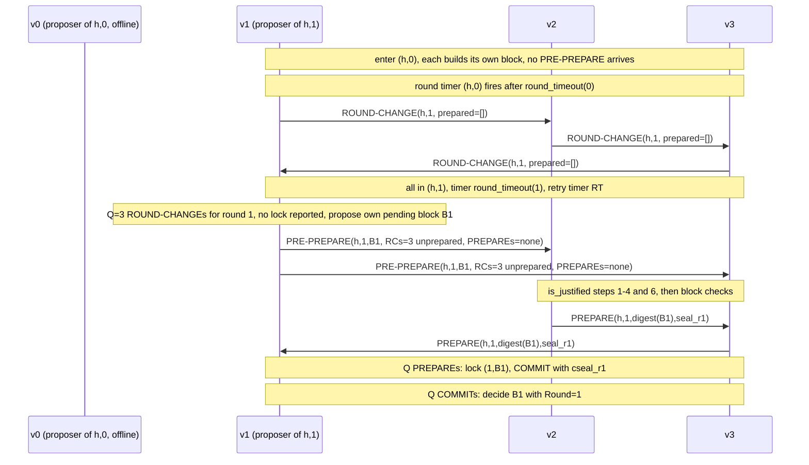

# A-14 Protocol: consensus as message exchange

- Area code: `PROTO`
- Status: draft
- Reference implementation: go-stablenet `740526d03`. All `Source:` paths are relative to the repository root.

This chapter describes WBFT as a protocol between nodes: who sends which message to whom, in which order, with which content, and what the receivers check, for one height in the normal case, when the round has to be changed, and after the round change. It is the chapter to read right after `A-00`.

---

## 1. Purpose and how to read it

`A-05` specifies WBFT as a set of reaction rules: for each event (a message, a timer, a new head) it states what one node does. That view is complete and normative, but it does not show the exchange as a whole. This chapter gives the other view: the sequence of messages that the reaction rules produce across the validators, and why the sequence has the shape it has.

Most statements here are consequences of requirements in other chapters and cite them by ID (`WBFT-SM-…` in `A-05`, `WBFT-TIMER-…` in `A-06`, `WBFT-NET-…` in `A-07`, `WBFT-MSG-…` in `A-03`, `WBFT-VAL-…`/`WBFT-PROP-…` in `A-04`, `WBFT-HDR-…` in `A-08`). Where the protocol view yields a testable property that no other chapter states, it is given here as a `WBFT-PROTO-NNN` requirement. If this chapter and a cited chapter disagree, the cited chapter is correct and this chapter has an editorial error.

Notation: `h` is the height (sequence) being agreed, `r` the round, `N` the number of validators of `h`, `Q = quorum_size(N)` and `F = f_value(N)` (`A-04` §2). `B` names a block. "Lock" means the pair `(current.prepared_round, current.prepared_block)` of `A-05` §3.1, and "certificate" means `prepared_certificate` (the `Q` PREPAREs that produced the lock).

---

## 2. Participants and roles

| Participant | Sends | Receives | Notes |
|---|---|---|---|
| Validator of `h` | PREPARE and COMMIT for every PRE-PREPARE it accepts; ROUND-CHANGE on round change; relays every message it processed successfully | all four messages from the other validators (directly or relayed) | every validator also builds a candidate block for `h` (`A-06` WBFT-TIMER-040), so it has a block to propose when it becomes proposer |
| Proposer of `(h, r)` | in addition, the PRE-PREPARE of `(h, r)` | as above | `calc_proposer(validators_at(h), last_proposer(h), r, policy)` (`A-04` WBFT-PROP-001); the same `last_proposer` for all rounds of `h`, so the proposer rotates with `r` |
| Node that runs the consensus core but is not in `validators_at(h)` | no message of its own (`A-05` WBFT-SM-003); it relays messages it processed (`A-07` WBFT-NET-040) | nothing from conforming peers (`A-07` WBFT-NET-031) | would still validate, relay and decide on messages it receives |
| Non-validator (full node, observer) | nothing on `istanbul/100` | nothing on `istanbul/100` | learns decided blocks, with their seals in the header, through eth block propagation and synchronisation (`B-09`) |

Two thresholds drive the protocol. `Q = floor(2N/3) + 1` (`A-04` WBFT-VAL-002) is the size of every quorum: PREPARE, COMMIT, ROUND-CHANGE, justification, and the minimum number of sealers in a header. The early round-change rule fires when the number of distinct validators that sent a ROUND-CHANGE for a higher round reaches exactly `floor((N-1)/3) + 1`, written "F+1" (`A-04` WBFT-VAL-003). Values for `N = 0 … 22` are in the table of `A-04` §2.2; for the examples in this chapter `N = 4`, so `Q = 3`, `F = 1` and F+1 = 2.

---

## 3. Messages at a glance

### 3.1 The four messages

Every message carries `sequence` and `round` and is signed with the sender's node key (ECDSA, `A-02` WBFT-CRYPTO-011) over `rlp([code, signed_fields])` (`A-03` WBFT-MSG-002). The sender is not a field: receivers recover it from the signature. Byte layouts are in `A-03` §8.

| Message | Code | Signed fields (ECDSA payload) | BLS seal carried | Unsigned attachments | Sent by, when | Size |
|---|---|---|---|---|---|---|
| PRE-PREPARE | `0x12` | `[sequence, round, proposal]` (the complete block) | none | `justification_round_changes` (signed ROUND-CHANGE payloads) and `justification_prepares` (PREPAREs), both empty in round 0 (`A-03` WBFT-MSG-040) | proposer of `(h, r)`: in round 0 when its block is built (`A-05` WBFT-SM-032); in round `r > 0` when it holds `Q` ROUND-CHANGEs for `r` (WBFT-SM-058) | the whole block, plus in round `r > 0` about 75–110 bytes per ROUND-CHANGE payload and about 204 bytes per PREPARE |
| PREPARE | `0x13` | `[sequence, round, digest, prepare_seal]` | `prepare_seal = bls_sign(seal_data(header(B), r, PREPARE_SEAL))` (`A-02` WBFT-CRYPTO-040, -042) | none | every validator that accepts the PRE-PREPARE of `(h, r)` (WBFT-SM-039, -040) | about 204 bytes (32-byte digest, 96-byte seal, 65-byte signature) |
| COMMIT | `0x14` | `[sequence, round, digest, commit_seal]` | `commit_seal = bls_sign(seal_data(header(B), r, COMMIT_SEAL))` | none | every validator on reaching `Q` PREPAREs for `(h, r)` (WBFT-SM-043, -044) | about 204 bytes |
| ROUND-CHANGE | `0x15` | `[sequence, round, prepared]` with `prepared = []` or `[prepared_round, prepared_digest]` (`A-03` WBFT-MSG-030) | none | `prepared_block` (the complete block) and `justification` (the `Q` PREPAREs of the certificate) (`A-03` WBFT-MSG-031) | every validator on a round timeout, on the F+1 rule, after a failed `finalize`, and on every retry timeout (WBFT-SM-051) | about 77 bytes without a lock; with a lock, the whole block plus about `Q × 204` bytes |

`digest` is always `block_hash(B)`, which excludes the current-block seals and the round (`A-03` WBFT-ENC-082, -083). `seal_data` includes the round (`A-02` WBFT-CRYPTO-040), so a seal is valid only for the round in which it was made. The sizes are computed from the encodings of `A-03` for small `sequence` and `round` values; they were not measured on a network.

The ECDSA signature of a PRE-PREPARE does not cover its justification, and the signature of a ROUND-CHANGE does not cover its `prepared_block` or `justification`. Each justification member carries its own signature, which the receiver checks (`A-05` WBFT-SM-017). The prepared block of a ROUND-CHANGE is bound to the signed `prepared_digest` by the decoder and by the handler (`A-03` WBFT-MSG-032, `A-05` WBFT-SM-054).

### 3.2 Wire framing and delivery

The four messages travel on the devp2p sub-protocol `istanbul/100`, next to `eth/68` on the same connection (`A-07` §2). With `eth/68` negotiated the wire codes are `0x33` to `0x36`. The frame payload is `rlp_encode(message)` unchanged, snappy-compressed by devp2p (`A-07` WBFT-NET-010). A payload longer than 10 MiB makes the receiver disconnect (WBFT-NET-013).

A node sends a message it created to every connected peer whose address is in the current validator set, except itself, and delivers it to itself through the normal receive path (`A-07` WBFT-NET-030, -031; `A-05` WBFT-SM-014). A node that processed a received message without error relays the same bytes (a message processed later from the backlog is relayed re-encoded, which for the ROUND-CHANGE cases of `A-03` WBFT-ENC-090 changes its bytes and key, WBFT-NET-041) to the validators that do not have its key yet (WBFT-NET-040, -032). Duplicates are suppressed per peer and globally by the key `keccak256(rlp_encode(payload))`, the hash of the payload encoded once more as an RLP byte string (WBFT-NET-022 to -024). Sends and deliveries are asynchronous, so no ordering between messages can be assumed, even from one sender (WBFT-NET-025, -033; `A-05` WBFT-SM-002).

---

## 4. Normal case: one height decided in round 0

### 4.1 Procedure

The steps below are what happens when every validator is correct and every message arrives within the round timeout. "Each validator" includes the proposer.

1. **New head.** Block `h − 1` becomes the chain head. Each validator processes the new head, enters view `(h, 0)` in state `AcceptRequest`, loads `validators_at(h)`, computes the proposer of `(h, 0)`, clears its round-change set and prepared certificate, and arms the round timer with `round_timeout(0) = RT(h)` (`A-05` WBFT-SM-022 to -030; `A-06` WBFT-TIMER-010). The node also replays any messages for `(h, 0)` that it had put in its backlog.
2. **Block-period wait and build.** Each validator's block builder waits until `Time(h − 1) + BP(h)` and then builds a candidate block for `h` (`A-06` WBFT-TIMER-040, -042). The finished block is handed to the consensus core as a request and stored as `pending_request` (WBFT-SM-032).
3. **PRE-PREPARE.** On the proposer, the request makes the core send `PRE-PREPARE(h, 0, B)` with empty justification lists (WBFT-SM-032, -035). Non-proposers only store their own block.
4. **Acceptance checks.** Each validator (the proposer through self-delivery) checks, in this order: the sender is the proposer of `(h, 0)`; `sequence == B.number`; `B` passes proposal verification (`A-08` §5, `A-09`). Round 0 has no justification check (WBFT-SM-037). A block whose timestamp is ahead of the receiver's clock is held until that time and then checked again (WBFT-SM-038, `A-06` WBFT-TIMER-030); a rejected PRE-PREPARE is neither answered nor relayed.
5. **PREPARE.** On acceptance the validator re-arms the round timer with the full `round_timeout(0)` from this moment, records the PRE-PREPARE, enters `Preprepared`, and broadcasts `PREPARE(h, 0, block_hash(B), prepare_seal)` (WBFT-SM-039, -040; `A-06` WBFT-TIMER-012). It relays the PRE-PREPARE.
6. **Prepared (lock).** Each validator checks every PREPARE for `(h, 0)`: the digest equals `block_hash(B)` and the prepare seal verifies with the sender's BLS key for round 0 (WBFT-SM-041). When `Q` distinct senders are stored, it sets its lock to `(0, B)`, keeps copies of those `Q` PREPAREs as its certificate, enters `Prepared` and broadcasts `COMMIT(h, 0, block_hash(B), commit_seal)` (WBFT-SM-043, -044).
7. **Decision.** Each validator checks every COMMIT the same way (WBFT-SM-045). When `Q` distinct senders are stored it enters `Committed`, aggregates the `Q` prepare seals and the `Q` commit seals it holds into `PreparedSeal` and `CommittedSeal` of `B`'s header, sets `Round = 0`, and hands the sealed block to the application for import (WBFT-SM-046 to -048; `A-08` WBFT-HDR-050). The block hash does not change (WBFT-HDR-051). The round timer is not stopped (WBFT-SM-050).
8. **Extra seals.** PREPAREs and COMMITs for `(h, 0)` that arrive after the respective quorum are verified and kept as extra seals; they are relayed (`A-05` §12, `A-07` WBFT-NET-042). The proposer of `h + 1` merges the extra seals it holds for `h` into `PrevPreparedSeal` / `PrevCommittedSeal` of block `h + 1` (`A-08` §3.8), so the chain records late sealers too.
9. **Next height.** When block `h` has been imported, it becomes the head and step 1 starts for `h + 1`. Nodes that did not decide themselves (a late validator, a non-validator) receive block `h` with its seals through eth block propagation and verify the seals in the header (`A-08` §6).

Because the header seals are node-local, two validators can store copies of block `h` with the same hash and different sealer sets (`A-08` WBFT-HDR-053, `A-05` WBFT-SM-048).

### 4.2 Sequence diagram (N = 4)

`v0` is the proposer of `(h, 0)`. Relays are omitted: every arrow to a validator also reaches it through the relays of the others. Self-deliveries are drawn as arrows to the sender.

```mermaid
sequenceDiagram
    participant v0 as v0 (proposer of h,0)
    participant v1
    participant v2
    participant v3
    Note over v0,v3: head = h-1, all enter (h,0), arm round timer RT(h)
    Note over v0,v3: wait until Time(h-1)+BP(h), each builds a candidate block
    v0->>v0: request(B), send PRE-PREPARE
    v0->>v1: PRE-PREPARE(h,0,B)
    v0->>v2: PRE-PREPARE(h,0,B)
    v0->>v3: PRE-PREPARE(h,0,B)
    Note over v0,v3: each checks proposer, number, block; re-arms timer; Preprepared
    v0->>v1: PREPARE(h,0,digest,seal_r0)
    v1->>v2: PREPARE(h,0,digest,seal_r0)
    v2->>v3: PREPARE(h,0,digest,seal_r0)
    v3->>v0: PREPARE(h,0,digest,seal_r0)
    Note over v0,v3: Q=3 PREPAREs: lock (0,B), certificate kept, Prepared
    v0->>v1: COMMIT(h,0,digest,cseal_r0)
    v1->>v2: COMMIT(h,0,digest,cseal_r0)
    v2->>v3: COMMIT(h,0,digest,cseal_r0)
    v3->>v0: COMMIT(h,0,digest,cseal_r0)
    Note over v0,v3: Q=3 COMMITs: Committed, seals aggregated into header, Round=0, finalize
    Note over v0,v3: block h imported, new head, enter (h+1,0)
```

The diagram shows one PREPARE and one COMMIT arrow per sender for readability; each validator broadcasts its PREPARE and COMMIT to all other validators.

### 4.3 Timeline

With the mainnet preset (`BP = 1 s`, `RT = 2 000 ms`, no cap), the times on one node are, following `A-06` §9.1 (where the worked example is given in full):

| Time | Event | Timer state |
|---|---|---|
| `T_head` | enter `(h, 0)` | round timer deadline `T_head + 2 s` |
| `Time(h − 1) + 1 s` | every validator builds; proposer's header `Time = Time(h − 1) + 1` | unchanged |
| + build and execution | PRE-PREPARE sent | unchanged |
| + one network delay | PRE-PREPARE accepted, PREPARE sent | round timer re-armed, deadline `t_accept + 2 s` |
| + two network delays | PREPARE quorum, COMMIT sent; COMMIT quorum, decision | round timer still running |
| + import time | new head, enter `(h + 1, 0)` | new round timer; the old one is cancelled |

The round timer of `(h, 0)` is cancelled only by the view change of the next head. If import takes longer than the remaining timeout, the node changes round although it has decided (§5.6).

---

## 5. Failures that lead to a round change

### 5.1 What a round change is

A round change is triggered by the round timer, not by the failure itself. The timer of `(h, r)` is armed on entering the round and re-armed on accepting a PRE-PREPARE, and nothing else stops it before the next view change (`A-06` WBFT-TIMER-010, -012, -016). When it fires the node enters `(h, r + 1)` in `AcceptRequest` and broadcasts `ROUND-CHANGE(h, r + 1)` whose prepared pair, prepared block and justification come from its lock and certificate (`A-05` WBFT-SM-053). What the ROUND-CHANGE contains therefore depends on how far the node got in round `r` (§6), not on what failed. The new round's timer is `round_timeout(r + 1)`, which doubles with each round up to the configured cap (`A-06` §4). Every ROUND-CHANGE sent also arms the retry timer (§5.8).

The failures below differ in which nodes reach which state before the timer fires.

### 5.2 Proposer absent, crashed, or PRE-PREPARE lost

No validator accepts a PRE-PREPARE, so every validator's timer fires `round_timeout(r)` after it entered `(h, r)`. Each is in `AcceptRequest` and sends `ROUND-CHANGE(h, r + 1)` without a prepared pair, unless it holds a lock from an earlier round of `h` (§6.2). The proposer of `(h, r + 1)` proposes its own block (§7). `A-06` §9.2 gives the timeline for a silent round-0 proposer.

### 5.3 PRE-PREPARE rejected

A receiver rejects a PRE-PREPARE that is not signed by the proposer, whose `sequence` differs from the block number, whose justification fails in round `r > 0`, or whose block fails proposal verification (`A-05` WBFT-SM-037). The rejection is silent: no message is sent and the PRE-PREPARE is not relayed (`A-07` WBFT-NET-043). A block whose timestamp is ahead of the receiver's clock is not rejected but held for the difference; if the hold is longer than the remaining timeout, the round ends first (`A-06` WBFT-TIMER-030, -033). Each validator that rejected it times out in `AcceptRequest` as in §5.2. Validators that accepted it are in `Preprepared` and time out as in §5.4.

### 5.4 PREPAREs lost: no PREPARE quorum

Validators that accepted the PRE-PREPARE but never collected `Q` PREPAREs time out in `Preprepared`, `round_timeout(r)` after their acceptance. Their ROUND-CHANGE has no prepared pair: the accepted block is not reported (§6.1). Validators that did reach `Q` PREPAREs are locked and report the lock.

### 5.5 COMMITs lost: no COMMIT quorum

Validators that reached `Prepared` but never `Q` COMMITs time out in `Prepared`. Their ROUND-CHANGE carries `(r, block_hash(B))`, the block `B` and the certificate. Because some other validator may have collected `Q` COMMITs and decided `B`, the new round must re-propose `B` unless a higher lock exists (§6.3).

### 5.6 Decided, but the block is not imported before the timer fires

After `decide`, the round timer keeps running (`A-05` WBFT-SM-050, `A-06` WBFT-TIMER-016). Two cases follow (`A-06` §5.4):

- **Case A: the head is still `h − 1`.** The node enters `(h, r + 1)` and sends `ROUND-CHANGE(h, r + 1)` carrying its lock `(r, B)`, the block and the certificate, exactly as a node in `Prepared` does (§6.1). If F+1 validators do this, the F+1 rule pulls the others into `r + 1` as well. When block `h` is imported, the node processes the new head and enters `(h + 1, 0)`. The decided block is not lost: every other node that enters `(h, r + 1)` either imports `h` first or sees `B` re-proposed.
- **Case B: the head advanced to `h` but the new-head event has not been processed.** The node takes the catch-up branch into `(h + 1, 0)` and sends `ROUND-CHANGE(h + 1, r + 1)` without a prepared pair but with the certificate of height `h` as justification; its round-change set and certificate are not reset, and they stay for the whole of height `h + 1` because the later new-head event selects no branch (`A-05` WBFT-SM-028, WBFT-SM-080, `A-06` WBFT-TIMER-017). Its retry timer remembers round 0, so it then retransmits `ROUND-CHANGE(h + 1, 0)` every `RT(h + 1)` (§5.8). The catch-up branch does not depend on the state: a node in any state whose head already moved to `h` when the timeout is processed (for example through synchronisation) takes it the same way.

If `finalize` itself fails (the seals cannot be written), the node sends `ROUND-CHANGE(h, r + 1)` with its lock at once, without leaving round `r` (`A-05` WBFT-SM-049). Its retry timer remembers round `r`, so until its round timer fires it retransmits `ROUND-CHANGE(h, r)` with the same lock every `RT(h)` (§5.8).

### 5.7 Partitions and nodes in different rounds

Timers are local, so nodes can be in different rounds: a node that accepted a PRE-PREPARE late, restarted, or was partitioned is behind. Two rules bring the rounds together:

1. **F+1 rule.** When a node in round `r0` has ROUND-CHANGEs for rounds above `r0` from exactly F+1 distinct validators, it enters the smallest such round and sends a ROUND-CHANGE for it immediately, without waiting for its own timer (`A-05` WBFT-SM-057). At least one of those senders is honest, so at least one honest node is already in a round above `r0`; the node moves to the smallest round any of the senders reported, which need not be that honest node's round. The rule fires only when the count reaches F+1, not when it jumps past it.
2. **Backlog.** Messages from other validators for a later round of the current height (up to `r0 + 10`) or for the next height with a round below 10 are kept (at most 88 per source) and replayed when the node gets there (`A-05` WBFT-SM-019, §13). A ROUND-CHANGE for a higher round of the current height is processed at once, not backlogged.

A partition that leaves fewer than `Q` validators on each side cannot decide on either side. Each side keeps timing out with growing timeouts and sends ROUND-CHANGEs for growing rounds. When the partition heals, the F+1 rule moves the lower side up and a quorum can form in a common round. Safety is not affected: a decision needs `Q` COMMITs, and two sides of a partition cannot both have `Q` (`A-05` §18.1).

### 5.8 Retransmission

Every ROUND-CHANGE a node sends arms a retry timer of `RT(h)` (no doubling). On expiry the node re-creates and re-signs a ROUND-CHANGE for the round it was in when the timer was armed, and re-arms the timer (`A-06` WBFT-TIMER-020, -021). This repeats until the node enters a new round or accepts a PRE-PREPARE (WBFT-TIMER-022, -023). After a round timeout or the F+1 rule the remembered round is the round of the original message. Because signing is deterministic and the encoding canonical, the repeated message is then byte-identical as long as the lock and certificate did not change, and gossip skips every peer that already has its key. Such a retransmission therefore reaches the wire only towards peers that connected after the original send or whose cache entry was evicted (`A-06` WBFT-TIMER-024). After a failed `finalize` (§5.6) the remembered round is `r`, so the retransmission is `ROUND-CHANGE(h, r)` instead of `(h, r + 1)`; after the catch-up branch (§5.6 Case B) it is `ROUND-CHANGE(h + 1, 0)` instead of `(h + 1, r + 1)`. These retransmissions differ from the original message and do reach the wire. A retry expiry that was already queued when the node entered height `h + 1` through the new-head event is still processed and sends `ROUND-CHANGE(h + 1, r_c)`, with `r_c` the round of height `h`, without a lock (`A-05` WBFT-SM-081, `A-06` WBFT-TIMER-021). Locally it re-runs the proposer's quorum check (§7.1). An implementation must not rely on retransmission to repair lost ROUND-CHANGEs between peers that stayed connected.

---

## 6. Round change by the stage at which it starts

### 6.1 The rule

The protocol differs depending on whether the round change starts "from PRE-PREPARE" (before a PREPARE quorum) or "from PREPARE" (after a PREPARE quorum); the dividing line is exactly the PREPARE quorum.

[WBFT-PROTO-001] The prepared pair and prepared block of a ROUND-CHANGE MUST be determined only by the sender's lock at the moment of sending, and the lock MUST be set only by a PREPARE quorum. Consequently, for a node whose round timer of `(h, r)` fires: (1) in `AcceptRequest` or `Preprepared` of round `r`, with no lock from an earlier round of `h`, the ROUND-CHANGE `(h, r + 1)` has `prepared = []`, a zero `prepared_digest`, no `prepared_block` and an empty `justification`, even if the node accepted a PRE-PREPARE in round `r`; (2) in `Prepared` or `Committed` of round `r`, it carries `prepared_round = r`, `prepared_digest = block_hash(B)`, `prepared_block = B` and the `Q` PREPAREs of round `r` for `B`; (3) with a lock `(r', B')` from an earlier round `r' < r` and no PREPARE quorum in round `r`, it carries `(r', B')` and the `Q` PREPAREs of round `r'`, whatever it accepted in round `r`. The exceptions are a locked block that the application has marked bad (§6.4), and a node that took the catch-up branch (§5.6 Case B): it sends `ROUND-CHANGE(h + 1, r + 1)` without a prepared pair, and until a PREPARE quorum in height `h + 1` replaces the certificate, every ROUND-CHANGE it sends in height `h + 1` without a lock carries the height-`h` certificate as `justification`.
Source: consensus/wbft/core/roundchange.go:63-82, consensus/wbft/core/prepare.go:119-137, consensus/wbft/core/core.go:277-288, consensus/wbft/core/roundstate.go:33-49, consensus/wbft/core/core.go:185-200, consensus/wbft/core/core.go:250-257
Observable: network

A ROUND-CHANGE never states the stage within the round beyond that: a node in `AcceptRequest` and one in `Preprepared` send the same message, and a node in `Committed` sends the same message as one in `Prepared`. In particular a decided node does not send its COMMIT quorum; the QBFT paper's reply with a commit certificate is not implemented (`A-13` §3.3), and decided blocks reach other nodes by block propagation.

### 6.2 Comparison

The table states, for a node whose round-`r` timer fires, what it sends, what it keeps and what that does to round `r + 1`. "Kept" and "cleared" follow the lifetimes of `A-05` §3.2 and WBFT-SM-028: the lock, the accepted PRE-PREPARE and the pending block are carried into round `r + 1`; the PREPARE and COMMIT sets are emptied; the certificate is kept; ROUND-CHANGEs for rounds below `r + 1` are deleted.

| Stage when the round-`r` timer fires | ROUND-CHANGE `(h, r + 1)`: `prepared_round`, `prepared_digest` | `prepared_block` | `justification` | Kept into round `r + 1` | Effect on round `r + 1` if this ROUND-CHANGE is in the proposer's quorum |
|---|---|---|---|---|---|
| `AcceptRequest` (no PRE-PREPARE accepted in `r`) | absent, zero | absent | empty | own pending block | none: counts as "not prepared" in `is_justified` step 6 |
| `Preprepared` (PRE-PREPARE for `B` accepted, fewer than `Q` PREPAREs) | absent, zero | absent | empty | accepted PRE-PREPARE of `r`, own pending block | none: `B` is not reported and is not re-proposed because of this node |
| `Prepared` (`Q` PREPAREs for `B` in `r`) | `r`, `block_hash(B)` | `B` | the `Q` PREPAREs of round `r` | lock `(r, B)`, certificate, accepted PRE-PREPARE, pending block | the proposer must re-propose `B` (or a block with a higher reported lock) with these `Q` PREPAREs as `justification_prepares` |
| `Committed` (`Q` COMMITs, block handed to the application, head not yet `h`) | `r`, `block_hash(B)` | `B` | the `Q` PREPAREs of round `r` | as `Prepared`; the decision is not reported | as `Prepared` |
| Lock `(r', B')` from an earlier round `r' < r`, no PREPARE quorum in `r` (state `AcceptRequest` or `Preprepared`, possibly for another block) | `r'`, `block_hash(B')` | `B'` | the `Q` PREPAREs of round `r'` | lock `(r', B')` unchanged, certificate of `r'`, the PRE-PREPARE accepted in `r` | as `Prepared`, for `B'` and round `r'` |
| Lock `(r', B')` from an earlier round, then `Q` PREPAREs for `B` in `r` | `r`, `block_hash(B)` | `B` | the `Q` PREPAREs of round `r` | lock moved to `(r, B)`, certificate replaced | a quorum that also contains `(r', B')` selects `B`: the highest prepared round wins |
| `Prepared`, but `B` is marked bad by the application (§6.4) | absent, zero | absent | the `Q` PREPAREs of round `r` (kept) | lock cleared, certificate kept | none; receivers ignore a justification without a prepared pair |
| `Committed`, `finalize` failed (sent at once, still in round `r`) | `r`, `block_hash(B)` | `B` | the `Q` PREPAREs of round `r` | node stays in `(h, r)`, `Committed` | as `Prepared` |
| Any state, head already `h` when the timeout is processed (catch-up, Case B; typically `Committed`) | absent, zero (message is `(h + 1, r + 1)`) | absent | the `Q` PREPAREs of height `h` | enters `(h + 1, 0)`; round-change set and certificate of `h` kept; they stay for the whole of height `h + 1`, because the later new-head event does not reset them (`A-05` WBFT-SM-028) | a spurious vote for round `r + 1` of height `h + 1` |

### 6.3 Why the protocol differs at the PREPARE quorum

A block can be decided in round `r` only after `Q` validators sent COMMIT, and a validator sends COMMIT only after collecting `Q` PREPAREs, that is, only when it is locked. So a validator that has not collected `Q` PREPAREs holds no evidence that anything could have been decided; it has only seen a proposal, and a proposal is not a commitment. It reports nothing, and the block it accepted is dropped with the round unless some locked validator reports it.

A validator that has collected `Q` PREPAREs holds a certificate that `B` may have been decided by others, even if it did not decide itself. If `B` was decided in round `r`, at least `Q − F` honest validators are locked on `(r, B)`, and any `Q` ROUND-CHANGEs include at least one of them, because two quorums share an honest validator (`A-05` §18.1). The justification rules of round `r + 1` turn this into a constraint on the next proposer:

- A PRE-PREPARE without PREPAREs is accepted only if `Q` of its ROUND-CHANGEs have no prepared pair (`is_justified` step 6). That is impossible once `B` has been decided, so no fresh block can replace `B`.
- A PRE-PREPARE with PREPAREs is accepted only if the `Q` PREPAREs are for its block in one round `pr`, and `Q` of its ROUND-CHANGEs report a prepared round no higher than `pr` with one of them reporting exactly `(pr, block)` (steps 5 and 7). So the proposer has to take the highest lock it was shown, together with the certificate that proves it.

This is why the new proposer's choice differs: with only unprepared ROUND-CHANGEs it proposes its own pending block; with at least one ROUND-CHANGE carrying a lock whose certificate matches, it re-proposes the block of the highest such lock (`A-05` WBFT-SM-058, WBFT-SM-055).

The lock restricts what a node reports, not what it votes for.

[WBFT-PROTO-002] A validator MUST NOT reject, hold back or answer differently a PRE-PREPARE for round `r > 0` because it is locked on another block or another round. A PRE-PREPARE that passes the checks of `A-05` WBFT-SM-037 MUST be accepted and answered with a PREPARE for its proposal whatever the receiver's lock. Accepting it does not change the receiver's lock; the lock changes only if that proposal then gathers `Q` PREPAREs in round `r`, or is cleared by the bad-block rule on the next round change (§6.4).
Source: consensus/wbft/core/preprepare.go:115-196, consensus/wbft/core/prepare.go:119-137
Observable: network

This is safe because `is_justified` already encodes the locks of a quorum: a PRE-PREPARE for another block can pass only if the proposer's `Q` ROUND-CHANGEs show that no block could have been decided with a higher lock. A conforming node that refused such a PRE-PREPARE would withhold its PREPARE and could cost the round.

### 6.4 The bad-block exception

When a node enters a new round of the same height and its locked block is marked bad by the application (it failed execution or import), the node clears the lock before carrying it over, and deletes every extra seal of heights up to and including `h` (`clear_extra_seals(node, h + 1)`, `A-05` WBFT-SM-024). The certificate is not cleared, so its next ROUND-CHANGE carries no prepared pair but a non-empty justification; receivers treat it as unprepared (WBFT-SM-054). This is the only way a node gives up a lock within a height, and it is how a proposal that gathered a COMMIT quorum but could not be imported is abandoned. It relies on every honest validator reaching the same verdict on the block (`A-05` §18.3).

### 6.5 What each node keeps across the round change

A node carries into round `r + 1` its accepted PRE-PREPARE, its lock and its pending block, and starts with empty PREPARE and COMMIT sets and `preprepare_sent = 0` (`A-05` WBFT-SM-005). It keeps its certificate (cleared only when `start_new_round` is called with round 0, WBFT-SM-028) and the ROUND-CHANGEs it holds for rounds `>= r + 1`. Its PREPAREs and COMMITs of round `r` are dropped, and any PREPARE or COMMIT for round `r` that arrives later is `OLD` (WBFT-SM-019). Seals of round `r` are therefore never counted in round `r + 1`: a re-proposed block is sealed again in the new round (§7.3).

All of this is in memory. A node that restarts inside a height has no lock and no certificate and sends unprepared ROUND-CHANGEs (`A-05` WBFT-SM-007; see §8).

---

## 7. Consensus after a round change

### 7.1 Collecting ROUND-CHANGEs and building the justified PRE-PREPARE

Every validator stores each valid ROUND-CHANGE for the current height and a round not below its own, one per sender per round. A ROUND-CHANGE whose prepared block, prepared round and justification are all present is checked against the current height and its digest (`A-05` WBFT-SM-054); it becomes the round's "highest prepared" entry if its prepared round is higher than the current entry and its justification holds `Q` PREPAREs from distinct senders for exactly that round and digest (WBFT-SM-055, -056). The BLS seals in the justification and the prepared block itself are not verified at this point (WBFT-SM-018).

The proposer of `(h, r)`, once in round `r`, evaluates its quorum rule every time it processes a ROUND-CHANGE (`A-05` WBFT-SM-058, -059):

1. It needs at least `Q` stored ROUND-CHANGEs for round `r`, and must not have sent a PRE-PREPARE in round `r` yet.
2. It selects the highest prepared block of round `r` if one is stored, otherwise its own pending block. If it has neither, it sends nothing and the ROUND-CHANGE just processed is not relayed.
3. It runs `is_justified` on its own choice with all the ROUND-CHANGE payloads it holds for round `r` and the justification PREPAREs of the highest prepared entry. If that fails it sends nothing and waits for more ROUND-CHANGEs.
4. It broadcasts `PRE-PREPARE(h, r, proposal)` with `justification_round_changes` = the signed payloads of all ROUND-CHANGEs it holds for round `r` (possibly more than `Q`) and `justification_prepares` = those PREPAREs, possibly empty.

The pending block used in step 2 is normally the block the proposer built in round 0, carried across rounds (§6.5); entering round `r` also starts a new build without waiting (`A-06` WBFT-TIMER-041), and when that build is handed over it replaces the pending block. Which of the two is proposed depends on whether the new build finished before the quorum.

The proposer's own ROUND-CHANGE counts towards its quorum through self-delivery. ROUND-CHANGEs for round `r` that arrive while the proposer is still in a lower round are stored and kept when it enters `r`, but the rule is not evaluated on entering the round; it is evaluated when the next ROUND-CHANGE of height `h` for a round `>= r` is processed (unless that message fires the F+1 rule), normally the proposer's own, self-delivered just after it entered. If the proposer has no block at that moment, the next evaluation waits for another such ROUND-CHANGE, possibly its own retransmission `RT(h)` later (`A-06` §6.3, §8.3).

### 7.2 Receivers' checks

A validator that receives `PRE-PREPARE(h, r, B')` with `r > 0` first verifies the ECDSA signature of the message and then of every justification member against its validator set (`A-05` WBFT-SM-017). This happens before `check_message`, so a PRE-PREPARE for a later round with an invalid member is dropped rather than backlogged. A validator in round `r` then checks the sender and the number as in round 0, then `is_justified(B', (h, r), justification_round_changes, justification_prepares, Q)` (WBFT-SM-061, -062):

1. deduplicate ROUND-CHANGEs and PREPAREs by sender, keeping the first of each;
2. at least `Q` ROUND-CHANGEs remain;
3. every ROUND-CHANGE is for exactly `(h, r)` (replays from another round or height are rejected);
4. the PREPAREs are either none or at least `Q`;
5. if there are PREPAREs, all are for one round `pr` and for `block_hash(B')`;
6. if there are no PREPAREs, at least `Q` ROUND-CHANGEs have no prepared pair (prepared round absent or 0, and a zero digest);
7. if there are PREPAREs, at least `Q` ROUND-CHANGEs have a prepared round absent or `<= pr`, and one of them has exactly `(pr, block_hash(B'))`.

Only after that is the block itself verified. The receiver does not compare `B'` with its own lock (WBFT-PROTO-002). A validator still in a lower round `r0` with `r - r0 <= 10` classifies the PRE-PREPARE as `FUTURE`, keeps it in its backlog without relaying it (unless its backlog for that sender is full), and processes it when it enters round `r` by its own timer or by the F+1 rule (`A-05` WBFT-SM-019, §13); one more than 10 rounds ahead is dropped (`TOO_FAR`).

### 7.3 PREPARE, COMMIT and decision in the new round

From acceptance on, round `r` runs exactly as round 0 (§4.1 steps 5–9) with `r` in every message: the round timer is re-armed with `round_timeout(r)`, and the PREPAREs and COMMITs carry seals over `seal_data(header(B'), r, ·)`. A re-proposed block `B` is therefore sealed again in round `r`; the PREPAREs of round `r'` in the justification are not counted and do not contribute seals (`A-05` §5.1). The decided header has `Round = r` and the aggregated seals of round `r`.

### 7.4 When the new round also fails

If round `r` does not decide, the same procedure repeats for `r + 1` with a timer of `round_timeout(r + 1)`, twice the previous one up to the cap (`A-06` §4). Locks travel from round to round: a lock is reported in every later ROUND-CHANGE of the height until it is replaced by a lock from a higher round or cleared by the bad-block rule. The proposer rotates with the round, so a run of silent proposers costs one round each. Nodes that fall behind are pulled forward by the F+1 rule (§5.7). Without a cap the timeout grows quickly (`A-06` §4.4: 34 minutes at round 10 on the mainnet preset), so a long outage leaves validators in rounds with long timers after connectivity returns; the F+1 rule and a justified PRE-PREPARE end such a round early, the timer does not.

### 7.5 Sequence diagram (i): round change without a lock (proposer absent)

`N = 4`, `Q = 3`. `v0` is the proposer of `(h, 0)` and is offline. `v1` is the proposer of `(h, 1)`.



### 7.6 Sequence diagram (ii): round change after a PREPARE quorum (lock carried)

`N = 4`, `Q = 3`. In round 0 only `v2` collects `Q` PREPAREs for `B` (the other PREPAREs to `v1`, `v3` are lost), so only `v2` is locked. `v1` is the proposer of `(h, 1)`.

```mermaid
sequenceDiagram
    participant v0 as v0 (proposer of h,0)
    participant v1 as v1 (proposer of h,1)
    participant v2
    participant v3
    v0->>v1: PRE-PREPARE(h,0,B)
    v0->>v2: PRE-PREPARE(h,0,B)
    v0->>v3: PRE-PREPARE(h,0,B)
    Note over v2: Q PREPAREs for B: lock (0,B), certificate of 3 PREPAREs, COMMIT sent
    Note over v0,v3: no COMMIT quorum anywhere, round timers (h,0) fire
    v1->>v1: ROUND-CHANGE(h,1, prepared=[])
    v2->>v1: ROUND-CHANGE(h,1, prepared=(0,digest(B)), block B, 3 PREPAREs of round 0)
    v3->>v1: ROUND-CHANGE(h,1, prepared=[])
    Note over v1: Q=3 ROUND-CHANGEs (own, v2, v3), highest prepared = (0,B), re-propose B, not its own block
    v1->>v0: PRE-PREPARE(h,1,B, RCs=3, PREPAREs=3 of round 0)
    v1->>v2: PRE-PREPARE(h,1,B, RCs=3, PREPAREs=3 of round 0)
    v1->>v3: PRE-PREPARE(h,1,B, RCs=3, PREPAREs=3 of round 0)
    v0->>v1: ROUND-CHANGE(h,1, prepared=[]) (after the PRE-PREPARE, not in it)
    Note over v0,v3: is_justified steps 5 and 7: PREPAREs for B in round 0, all RCs report round <= 0, one reports (0,B)
    v3->>v0: PREPARE(h,1,digest(B),seal_r1)
    Note over v0,v3: Q PREPAREs in round 1: lock (1,B); Q COMMITs: decide B with Round=1, Coinbase still v0
```

If `v1`'s first three ROUND-CHANGEs had been from `v0`, `v1` and `v3` (all unprepared), `v1` would have proposed its own block, and `v2` would have accepted it (WBFT-PROTO-002). That is safe: with only `v2` locked, `B` cannot have been decided, since a decision needs `Q = 3` COMMITs and thus three locked validators, one of which would be among any three ROUND-CHANGEs.

---

## 8. Safety and liveness at the protocol level

`A-05` §18 gives the argument. In protocol terms:

- **Agreement.** Two different blocks cannot both be decided at one height: in one round, because PREPARE and COMMIT quorums intersect in an honest validator that sends at most one PREPARE and one COMMIT per view (`A-05` WBFT-SM-083); across rounds, because a decided block leaves a quorum-intersecting set of locks that every later justified PRE-PREPARE must respect (§6.3).
- **Validity.** Every decided block passed proposal verification at `Q` validators, and every header carries `Q` aggregated seals that any verifier can check (`A-08`).
- **Liveness.** Under partial synchrony the round timeout grows until it exceeds the time a correct proposer needs, rounds are aligned by the F+1 rule, and a correct proposer is reached by rotation.

---

## 9. Differences from QBFT at the protocol level

WBFT keeps the QBFT message set, the ROUND-CHANGE payload and the structure of the justification rules (`A-13` §3.1). The comparison below is against ConsenSys Quorum at commit `5ffacc48` (GoQuorum 24.4.1, `consensus/istanbul/qbft/**`) and, separately, against the QBFT paper (Moniz, arXiv:2002.03613 v2) (`A-13` §3.2, §3.3) and against the ConsenSys QBFT formal specification (commit `1630128e7`, Dafny; `A-13` §3.4, `A-05` §18.5).

Differences from Quorum's QBFT implementation:

- PREPARE and COMMIT carry BLS seals bound to the round; the header of the decided block carries the aggregated PREPARE and COMMIT seals, and late seals are carried in the next block.
- A header needs `Q` sealers (Quorum accepts `F + 1` committed seals), and the quorum is `floor(2N/3) + 1` (`A-04` §2.3).
- The PRE-PREPARE is also checked for `sequence == block number`; the signatures of its PREPARE justification are verified (Quorum verifies only the ROUND-CHANGE justification of a PRE-PREPARE).
- A ROUND-CHANGE whose prepared block has another number than the current sequence, or whose prepared block hash differs from its prepared digest, is rejected.
- The justification check deduplicates senders and rejects ROUND-CHANGEs for another view.
- ROUND-CHANGE is retransmitted by a retry timer, but byte-identical copies do not go on the wire again (a retry that differs from the original, §5.8, is sent).
- The round timer is armed on entering every view, including round 0 (Quorum arms the round-0 timer when the node's own block request or an accepted PRE-PREPARE arrives).
- The block-period wait happens before the block is built, not in `Seal` after it has been built.

Differences from the paper that Quorum shares: rounds start at 0; the proposal comes from the block builder; a future-dated PRE-PREPARE is deferred; the round timer is not stopped at the decision and a decided node does not answer ROUND-CHANGEs with a commit certificate; `prepared_round < round` is not required of a ROUND-CHANGE; the F+1 rule fires only when the count is exactly `F + 1`.

Differences from the formal specification. The formal specification and Quorum disagree in several places, and WBFT does not side with one of them throughout (`A-13` §3.4):

- WBFT follows the formal specification where Quorum does not: a justification counts each ROUND-CHANGE sender once and only ROUND-CHANGEs for the proposal's view; the signatures of the PREPARE justification members are verified; the seal of every COMMIT is verified on receipt; a header needs a quorum of seals; the round-0 timer runs from the start of the height; a block request leads to a PRE-PREPARE only in round 0.
- WBFT follows Quorum where the formal specification differs: the F+1 rule fires only at exactly `f + 1` and before the proposal rule; the round timer restarts at every PRE-PREPARE acceptance; a COMMIT is processed only after the PREPARE quorum; a PRE-PREPARE for a higher round waits in the backlog instead of moving the node to that round; a justification needs `Q` qualifying ROUND-CHANGEs rather than all of them, and does not require `prepared_round < round`, the PREPARE sequence, or a block built by the round leader; decided blocks travel on the `eth` protocol, not in a `NewBlock` consensus message.
- WBFT differs from both in the bad-block unlock (`A-05` WBFT-SM-024) and in staying in the decided round with a running timer until the new head arrives (`A-05` WBFT-SM-050).

The formal proof of agreement assumes a validator set that never changes and nodes that never lose their state; WBFT changes the set at every epoch and keeps no consensus state across a restart (`A-05` §18.5).
